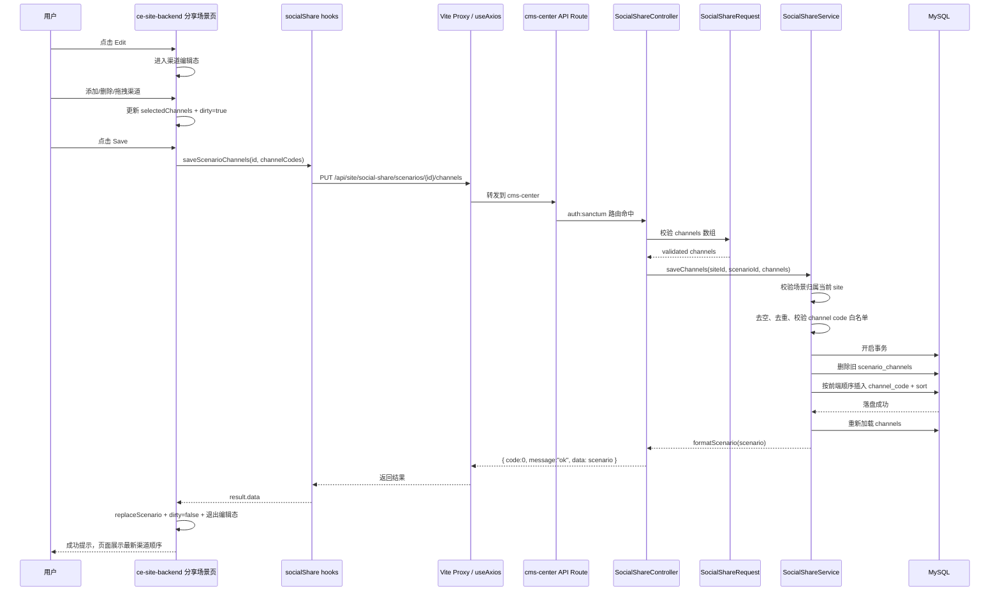
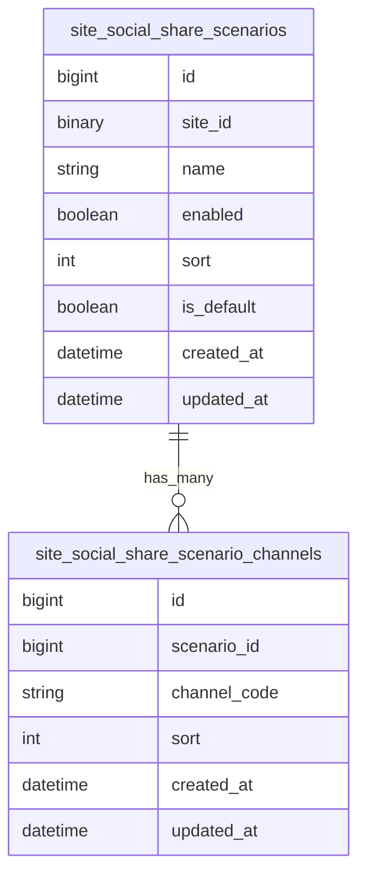

# 1. 这次 Soical Share::Scenario 做了什么

核心目标：把"分享渠道配置"从页面激活逻辑里拆出来，改成按"分享场景 Scenario"管理。

用户行为现在是：

- 后台进入 `Marketing -> Share Scenario`
- 创建 / 重命名 / 启用 / 禁用 / 删除分享场景
- 选择某个场景
- 点击 `Edit` 进入渠道编辑态
- 添加、删除、拖拽排序分享渠道
- 点击 `Save` 保存渠道配置
- 前端页面后续只需要选择某个场景，即可复用该场景下配置好的渠道

已取消：

- 原型里的 `Activated page / 激活页面` 功能
- 不再通过"激活页面"绑定渠道
- 改为"页面选择场景，场景决定渠道"

# 4. 端到端流程 Mermaid

# 3. 数据模型

# 4. Harness Infra 建设

## 4.1 一句话定位

这次 `cms-center` 的 `AGENTS.md + .codex/infra/*.md` 建设，属于 Harness infra 的第一层底座建设。它已经把 AI Coding 开发中最容易失控的几个环节标准化：项目上下文、开发边界、代码风格、测试验证、Git 协作、安全配置和完成检查。

但它还不是完整的第一周 AI 开发闭环模板。它更偏工程执行规范，能够支撑 MVP 开发落地，但对“需求对齐、方案确认、反馈优化、成功失败经验沉淀、后续需求复用清单”的支撑还不够，需要后续继续补齐。

## 4.2 建设内容

1. **`AGENTS.md`** 作为 Harness 入口
   - 告诉 AI：这是 Laravel 12 CMS 后台，核心目录在哪里、技术栈是什么、常用命令是什么、开发必须走 worktree / feature 分支 / 单仓测试 / 单仓 PR。
   - 解决"AI 进项目后先看什么、怎么不乱改"的问题。

2. **`.codex/infra/guidelines.md`** 作为 AI 行为准则
   - 约束 AI 在开发前先明确假设、需求边界和成功标准，避免直接开写。
   - 强调简单优先、精准修改、目标驱动验证。
   - 对应第一周里的"需求理解、任务拆解、方案确认"。

3. **`.codex/infra/coding-style.md`** 作为代码生成约束
   - 统一 PHP / Laravel 风格、命名规则、格式化、静态分析和小函数原则。
   - 保证 AI 生成代码不是孤立可运行，而是符合项目已有工程风格。

4. **`.codex/infra/testing.md`** 作为验证闭环约束
   - 明确什么时候跑 `composer test`、`vendor/bin/phpstan analyse`、`vendor/bin/pint`。
   - 明确什么时候必须新增测试，无法测试时要说明原因。
   - 对应"完成最小版本开发后必须可验证"。

5. **`.codex/infra/git.md`** 作为协作交付约束
   - 规范 commit、PR、截图、migration、配置变更说明。
   - 避免 AI 只完成代码不完成交付材料。
   - 对应"团队协作规范和需求交付节奏"。

6. **`.codex/infra/completion.md`** 作为收尾检查清单
   - 要求最终说明改了什么、怎么验证、剩余风险是什么。
   - 对应第一周的"验证反馈和复盘沉淀"。

7. **`.codex/infra/docs.md`** 和 **`.codex/infra/security.md`** 作为长期约束
   - `docs.md` 保证工作流变化能沉淀成文档。
   - `security.md` 限制 `.env`、secrets、生产配置、破坏性命令等高风险行为。
   - 支撑后续第 2 个到第 N 个需求的持续复用和安全交付。

## 4.3 按第一周目标映射

| 第一周目标 | Harness infra 承接情况 | 结论 |
|---|---|---|
| 明确独立需求范围 | `guidelines.md` 要求先说明假设、不确定点、成功标准 | 有支撑，但缺需求对齐模板 |
| 使用标准 Harness 工程开展开发 | `AGENTS.md` 固化项目概览、目录入口、技术栈、命令、worktree、分支规则 | 支撑明确 |
| 跑通标准 AI 开发流程 | `guidelines.md` 约束先思考、简单优先、精准修改、目标驱动验证 | 有流程意识，但缺完整流程记录模板 |
| 完成最小版本开发 | `guidelines.md` 的简单优先、避免过度设计支撑 MVP；`coding-style.md` 保证实现质量 | 支撑明确 |
| 快速响应与优化 | `testing.md`、`completion.md` 支撑修正后的验证和风险说明 | 间接支撑，缺反馈优化记录 |
| 沉淀成功 / 失败经验 | `docs.md` 要求工作流变化同步文档 | 支撑较弱，缺 Prompt、失败案例、踩坑记录机制 |
| 形成后续优化方向 | `completion.md` 要求记录风险和后续事项；`git.md` 规范 PR 交付材料 | 间接支撑，缺复用清单 |

本次在 `cms-center` 中补充的 `AGENTS.md` 和 `.codex/infra` 规则，主要完成了 Harness infra 的基础工程化建设。`AGENTS.md` 作为项目级入口，帮助 AI 快速识别项目结构、技术栈、常用命令和分支协作规则；`.codex/infra` 则把通用行为准则、代码风格、测试验证、Git/PR、安全配置、文档维护和完成检查拆分成可复用规则。

## 4.4 汇报表述

这次 Harness infra 建设的价值，是把一次 share 功能开发中容易依赖个人经验的部分，转成了 AI 可读取、可执行、可复用的工程规则。

`AGENTS.md` 负责项目入口和工程边界，`.codex/infra` 负责把行为准则、代码风格、测试验证、Git 协作、文档沉淀、安全配置和完成检查拆成独立规则文件。

这样后续做第二个、第三个需求时，AI 不需要重新摸索项目习惯，可以沿着同一套流程快速进入上下文、最小范围改代码、按标准验证并输出交付说明。
