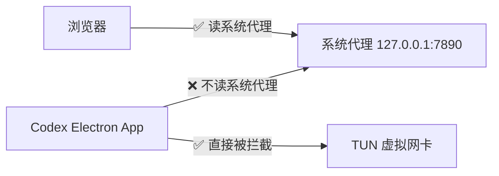

# Codex 桌面版不走本地 VPN 代理 / 重连超时

> 来源: 2026-06-09 用户问题 + 多源搜索汇总

## 问题

Codex 桌面端(Electron 应用)开本地 VPN(如 Clash Verge / v2rayN)的系统代理模式时,Codex 不走代理,反复重连超时。只有把 VPN 切成 TUN 模式(虚拟网卡)才能正常工作。

## 根因

**Codex 桌面端(一个 Electron 应用)不会像浏览器那样,默认去读取 Windows 的系统代理设置。** 系统代理只对走 WinINET/WinHTTP 的应用生效(IE、Edge、大部分 .NET 应用),Electron 默认不走这套,所以系统代理模式对 Codex 完全无效。

TUN 模式之所以能工作,是因为它在网络层(虚拟网卡)拦截所有流量,不依赖应用层是否读取系统代理。



## 方案一:使用 `.env` 文件(推荐,一劳永逸)

在 Codex 的专属配置目录 `%USERPROFILE%\.codex`(即 `C:\Users\你的用户名\.codex`)里放一个 `.env` 文件。

### 步骤

1. 打开资源管理器,地址栏输入 `%USERPROFILE%\.codex` 回车
2. 如果文件夹里没有 `.env`,新建文本文件命名为 `.env`
3. 写入代理配置(端口改成你代理软件的真实端口):

```ini
HTTP_PROXY=http://127.0.0.1:7890
HTTPS_PROXY=http://127.0.0.1:7890
ALL_PROXY=socks5://127.0.0.1:7890
NO_PROXY=localhost,127.0.0.1
```

4. 保存文件,完全退出 Codex(右键系统托盘图标退出),重新启动

> **关键点**:Codex 启动时会自动读取 `~/.codex/.env`,无需任何额外操作。这个方案的原理是让 Codex 的 Node.js 进程在启动时从 `.env` 加载 `HTTP_PROXY` / `HTTPS_PROXY` 环境变量,从而让所有网络请求走代理。

## 方案二:PowerShell 启动脚本

不想配 `.env` 的话,每次用脚本带着环境变量启动:

```powershell
$env:HTTP_PROXY="http://127.0.0.1:7890"
$env:HTTPS_PROXY="http://127.0.0.1:7890"
$env:ALL_PROXY="socks5://127.0.0.1:7890"
Start-Process "C:\Users\$env:USERNAME\AppData\Local\Programs\codex\Codex.exe"
```

> 缺点:每次都要用脚本启动,不如 `.env` 方案方便。

## 方案三:持久环境变量(全局生效)

在 Windows 系统环境变量中设置 `HTTP_PROXY` 和 `HTTPS_PROXY`:

```powershell
[System.Environment]::SetEnvironmentVariable('HTTP_PROXY', 'http://127.0.0.1:7890', 'User')
[System.Environment]::SetEnvironmentVariable('HTTPS_PROXY', 'http://127.0.0.1:7890', 'User')
```

> ⚠️ 注意:这会全局影响所有 Node.js / Python 等读这些环境变量的应用,不是仅针对 Codex。如果只有 Codex 需要代理,用方案一。

## 方案四:配置 VS Code 代理(如果你是在 VS Code 里用 Codex 插件)

VS Code 设置里搜索 `proxy`,填入:

```json
"http.proxy": "http://127.0.0.1:7890"
```

> 这只对 VS Code 内置的 Codex 插件有效,对独立的 Codex 桌面端无效。

## 总结

| 方案 | 适用场景 | 是否持久 |
|------|---------|---------|
| `.env` 文件 | Codex 桌面端 | ✅ 一次配置永久生效 |
| PowerShell 启动脚本 | Codex 桌面端 | ❌ 每次都要用脚本启动 |
| 持久环境变量 | 全局 | ✅ 但影响所有应用 |
| VS Code proxy 设置 | VS Code 插件 | ✅ 仅 VS Code |
| TUN 模式 | 所有应用 | ✅ 但改变网络架构 |

**推荐方案一**(`.env` 文件),最轻量、最精准,不需要改系统设置也不需要切 TUN 模式。
