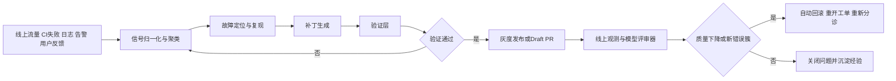

# 自动发现并修复 Bug 的 Agent 公司与技术路线分析

## 执行摘要

基于目前能公开检索并交叉验证到的同题播客页面、节目章节说明与采访整理稿，你听到的那家“能自动开发功能、自动发现 bug、自动生成修复并自动验证”的公司，**高度疑似是硅谷的 Creao AI**。最关键的识别证据不是泛泛的“AI 写代码”，而是这组高度特异的说法在同一公开节目中同时出现：Apple Podcasts 节目页明确点名 **Creao** 三位创始人作为嘉宾，并给出 **19:12「Agent 主导排查 bug，50%以上问题由 AutoFixing 自动修复」**、**23:48「搭建整个 Agent 系统，只需要 1 个 Architect 用一周定框架」**、**32:02「CreaoAI 2026 年 1 月用两周完成全部架构重构」** 等章节；36Kr 的公开整理稿又进一步展开了他们所谓 **Agent-driven CI/CD、bug triage 与 auto-fixing** 的做法。[^1]

但这份识别仍要保留一个重要不确定性：**用户提供的 xima.tv 原始链接，我未能直接取得可引用的转写文本**。因此，严格意义上我不能把“原始音频已直接核验”说满；我能确认的是，公开可检索镜像里存在一集与用户描述高度重合的节目，而且 Apple 页面还写明《硅谷101》同步分发到 **喜马拉雅**，这使“你在喜马拉雅镜像里听到的正是这集”成为当前最强解释。[^2]

技术上，这类“自动发现 bug → 自动生成修复 → 自动验证并灰度/部署”的闭环**今天已经可行，但只在约束明确、验证充分、回滚迅速的范围内真正可靠**。它并不是单一模型的一次神奇输出，而是多层工程系统叠加的结果：可观测性、静态/动态分析、自动化测试、补丁生成、灰度发布、自动回滚、以及持续评估与再训练。Creao 的公开写法把它称为 **Grader + Engineering Pipeline + Bridge**；更早的工业先例则包括 Meta 的 **SapFix** 和学术/开源方向的 **Repairnator、SWE-agent、OpenHands**。[^3]

如果把问题换成“这种能力到底是不是噱头”，我的结论是：**不是纯噱头，但也绝不是无条件成立**。它对“低风险、局部、可测试、可复现”的 bug 修复非常现实；对“涉及业务语义、架构重构、安全边界、弱测试套件、隐性需求”的问题仍然高度依赖人类做架构判断、风险审查和验收。Creao 自己公开描述的流程中，人类没有完全消失，而是从“逐行写代码”转向“定义边界、审 PR 风险、校准评审器、决定是否放量”。APR 研究也长期指出，**让所有测试通过** 并不等于**真实修对了**，因为会出现“看起来 plausible、却不泛化”的 deceptive patch。[^4]

对你这样的 Python/Node 工程师，最实用的路线不是一上来追求“全自动无人值守上线”，而是先做一个**受控 PoC**：让 agent 处理 **CI 失败、静态扫描告警、或线上日志里可复现的低风险 bug**，在沙箱里改代码，经过单元/集成/E2E/性质测试与安全扫描后，只生成 **Draft PR** 或低流量灰度发布。Anthropic 和 OpenAI 的公开工程建议都偏向**简单、可组合、可观测的 agent 工作流**，而不是一开始堆复杂多智能体框架。[^5]

## 播客内容核验

先说核验边界：**原始 xima.tv 链接未能直接提取出可引用的正文或逐字稿**，因此下面的“播客内容核验”是基于同题、同嘉宾、同章节说明的公开镜像页面完成的。当前最强证据来自 Apple Podcasts 的节目页与 36Kr 对该集内容的公开整理。Apple 页明确写出节目名、嘉宾、章节时间戳，并注明《硅谷101》同时分发到 Apple、Spotify、小宇宙、喜马拉雅等平台。[^2]

| 核验层级 | 结果 |
|---|---|
| 用户给出的 xima.tv 原始链接 | 未能直接取得可引用的转写文本 |
| 公开镜像节目页 | 明确点名 **Creao** 与三位联合创始人 |
| 公开整理稿 | 明确描述 **Agent-driven CI/CD、bug triage、AutoFixing、guardrails** |

上表的依据主要来自 Apple Podcasts 节目页和 36Kr 整理稿。[^6]

下面是与“自动发现 bug、自动修复、自动验证”最相关的时间戳陈述。若严格要求“只算原始 xima 音频”，则公司名与技术细节应标记为“未直接核验”；若采用公开镜像，则这些点都已经明确写出。[^6]

| 时间戳 | 可核验陈述 | 公司名状态 | 相关技术状态 |
|---|---|---|---|
| 08:10 | “一篇 X 爆文，揭秘 CreaoAI 的 Harness 实战” | 公开镜像明确为 **Creao** | 明确指向 Harness |
| 19:12 | “Agent 主导排查 bug，50%以上问题由 AutoFixing 自动修复” | 公开镜像明确为 **Creao** | 明确涉及自动 bug triage 与 auto-fix |
| 23:48 | “搭建整个 Agent 系统，只需要 1 个 Architect 用一周定框架” | 公开镜像明确为 **Creao** | 明确涉及 agent 系统工程化 |
| 32:02 | “CreaoAI 2026 年 1 月用两周完成全部架构重构” | 公开镜像明确为 **Creao** | 明确涉及系统性重构 |
| 47:47 | “信任从人转向 AI 需要 guardrails” | 公开镜像明确为 **Creao** | 明确涉及安全边界/护栏 |

该表的时间戳来自 Apple 节目页的章节说明；技术展开来自 36Kr 整理稿。[^6]

更关键的是，36Kr 的公开整理稿把 19:12 对应的方法细化成了工程闭环：他们说自己做了 **Agent-driven CI/CD system** 和 **Agent-driven bug triage system**；bug 可以在 **1–2 分钟**内被识别并分配，工程师再借助 agent 调查与给出方案，整个周期约 **1–2 小时**；此外，他们还提到 **“more than 50% of the problems are solved through auto-fixing”**，并说明对低风险目录下的问题，AI 会自动提交 PR，由工程师做简单审批后发布。这个表述与用户的记忆——“自动发现 bug、自动修复、自己回归验证、流程自动化”——高度一致。[^7]

因此，本报告对“播客内容”的结论是：**原始短链未能直接转写，但公开同题镜像足以把核心陈述锁定到 Creao 的 self-healing / harness 式工程实践上**。如果你之后能提供该喜马拉雅音频的标题或片段时间戳，我可以把“不确定性”进一步压缩到接近零。[^6]

## 公司识别与背景

当前最强识别结果是 **Creao AI**。节目页写明这集《硅谷101》的嘉宾是 **Kai（联合创始人/CEO）、Peter（联合创始人/CTO）、Clark（联合创始人/CPO）**；Business Wire 的融资公告写明公司位于 **Cupertino, California**，2026 年 4 月宣布完成 **1000 万美元**新融资、累计融资 **2500 万美元**，并称公司自 2025 年 9 月产品发布以来获得 **20 万用户**。需要说明的是，这些用户数与规模数据是**公司公告口径**，并非第三方审计口径。[^8]

| 维度 | 识别结果 |
|---|---|
| 公司名 | Creao AI |
| 官网 | CREAO 官方站点与产品入口 |
| 官方定位 | “AI agents that run your work”“AI super agent” |
| 对外产品 | 会话式生成 agent、保存为可复用 agent、定时运行、记忆、连接器、浏览器自动化 |
| 创始团队 | Kai Cheng、Peter Pang、Clark Gao |
| 已公开背景 | Peter Pang 曾参与 Meta Llama 3 团队，并曾在 Apple 从事多模态模型工作 |
| 融资与地域 | 2026 年 4 月公司公告称累计融资 2500 万美元，位于美国加州 Cupertino，团队分布于美国、加拿大和香港 |
| 公开演示/资料 | 官网、文档站、产品入口、官方 YouTube 教程、X 帖文与博客 |

这张背景表主要来自 Creao 官网、产品文档、融资公告和公开访谈。[^9]

一个容易误解的点是：**Creao 对外卖的并不只是“自动修 bug 工具”**。其公开文档把产品描述为一个可搜索网页、写代码、调用集成、生成文件、保存为可复用 agent、定时运行并带持久记忆的 **super agent** 平台；而“self-healing Agent Harness”更多是他们**内部用于构建和维护 Creao 自己产品**的工程系统，也是他们在播客里最被关注的那一套能力。换句话说，**你在播客里听到的更像是其内部软件工程基础设施，而不是一个单独对外 SKU 的 bug 修复器**。[^10]

如果把“原始喜马拉雅链接未能直接核验”这一不确定性考虑进来，还可以列出几个次级候选，但匹配度都弱于 Creao：

| 候选 | 为什么像 | 为什么不像 |
|---|---|---|
| Cognition Devin | 官方博客已公开 “自动修 PR 评论”“自动把 CI/lint 跑到全绿”“自动修前端 bug、起草 PR” 的工作流 | 没有找到与你描述同样精确的中文播客章节证据；其公开表述更偏“Devin 作为软件工程 agent”，而不是你听到的那种 self-healing harness 叙述 |
| Factory AI | 官方口径明确说 Droids 会自动化 coding、testing、deployment，且面向企业软件工程团队 | 公开证据更偏产品能力与 benchmarks，没有找到与你记忆中的播客章节一一对应的公开中文节目说明 |
| Emergent | 公开中文播客摘要里出现“端到端自主技术栈覆盖部署、测试、bug 修复”这类措辞 | 公司是印度创业公司，不符合你记忆里的“美国创业公司” |

这个候选比较来自各公司的官网、官方博客与公开播客摘要。[^11]

所以，本报告后续将把 **Creao AI 视为最高概率识别对象**，同时在涉及公司口径数据时保持“公司自述”的标注。[^12]

## 技术实现分析

从工程角度看，“自动发现 bug → 自动生成修复 → 自动验证并部署”**不是一个模型能力问题，而是一个系统设计问题**。Creao 自己公开把这件事拆成三块：**Grader** 负责给线上响应打分、**Engineering Pipeline** 负责把低分或生产错误转成工单/PR/验证、**Bridge** 负责把评分系统接入灰度放量与回滚；这种设计和更早的工业方案 SapFix、Repairnator 在思想上是相通的：**发现信号必须直接进入工程闭环，而不能只是落成一个无人看的 dashboard**。[^13]



上图概括了今天最可行的闭环结构；它与 Creao 公开披露的 “grade → triage → fix → verify → gate releases” 循环，以及 Meta SapFix 的“测试生成 + 自动修复 + 持续集成/部署”路线一致。[^14]

为了更具体一些，可以把这类系统分解成下表中的几层：

| 组件 | 典型工具或代表方法 | 现实中负责什么 | 可行性与主要局限 |
|---|---|---|---|
| 自动发现层 | OpenTelemetry、Sentry、CodeQL、Semgrep | 从线上日志/Tracing、异常聚类、静态规则与安全扫描里找到“疑似 bug 信号” | 很可行；但只能发现“可观测到”的问题，业务语义错误、弱信号问题常常漏掉 |
| 复现与定位层 | GitHub Actions、容器化沙箱、KLEE、SemFix 一类语义分析 | 还原失败环境、提取最小复现、定位可能出错文件/路径/条件 | 对 CI 失败、解析器类 bug、确定性错误很有效；但对 flaky test、分布式 race、第三方依赖抖动会变难 |
| 自动补丁层 | GenProg、SequenceR、AlphaRepair、SWE-agent、OpenHands、Devin 类 agent | 生成代码编辑、补测试、改配置、修工具调用或 PR 里的机械性问题 | 对局部修复相当现实；但“所有测试通过”仍可能是假修复 |
| 自动验证层 | pytest、Playwright、Hypothesis、AFL++、CodeQL、Semgrep | 验证修复是否让单元/集成/E2E/性质/模糊/静态扫描全部达标 | 是闭环最重要一层；若测试弱、覆盖差、环境不稳定，自动修复的可信度会迅速下降 |
| 发布与回滚层 | GitHub Actions、Argo CD、LaunchDarkly、OpenFeature | 通过 canary、feature flag、自动回滚把 blast radius 压小 | 非常关键；没有渐进发布和 kill switch，就不应该让 agent 直接进生产 |
| 持续学习层 | AI grader、人工校准、SWE-smith 一类合成数据管线 | 用真实失败样本和合成任务回灌评估器、修复器和训练数据 | 可明显提升系统迭代速度；但要防 benchmark 污染与“自评自嗨” |

表中工具与方法来自其官方文档、论文或官方仓库。[^15]

这里面最容易被忽略的事实是：**“自动发现 bug”本身不是一种单一算法**。它通常是多种信号叠加：静态扫描发现已知错误模式，单元/集成/E2E 测试发现回归，性质测试和模糊测试发现边界条件，线上日志和 tracing 发现生产故障，而 AI grader 则在 agent 产品里把“用户感知到的坏回答”转成结构化低分信号。Creao 的公开做法就是把后者用到极致：每次响应之后异步触发 grading endpoint，先按领域路由，再由三个不同模型家族并行打分，把低分样本直接送进 ticketing 与修复流程。[^16]

另一个决定成败的点是**代码库与环境的“可读性”**。Peter Pang 在公开访谈里明确说过，他们把原先分散的系统统一成更可被 agent 理解和验证的形态，因为对 agent 来说，跨多个仓库、跨多个服务、缺少一致测试环境的系统是“不透明的”。这与 SWE-agent/OpenHands 这类开源项目的经验一致：agent 需要的不只是更强模型，而是**能搜索、编辑、运行、回读结果的 agent-computer interface** 和**可隔离的临时工作区**。[^17]

如果问“是否真的能做到自动部署”，答案是：**能，但应该被理解为‘在严格护栏内的自动推进’，而不是‘什么都能直接上线’**。Creao 自己公开的 guardrails 包含：敏感路径自动拒绝、类型错误和失败测试阻塞 PR、灰度流量逐步从 5%/10% 放到 20%/50%/100%、评分下降或出现新错误簇就回滚并重开工单；这与 LaunchDarkly/OpenFeature 一类 feature flag / progressive delivery 思想完全一致。[^18]

## 具体算法与模型

“自动修复”这件事并不是从 LLM 才开始。它有一条很长的技术谱系：从**基于搜索的程序修复**、**基于语义约束与符号执行的修复**、**神经程序修复**、到今天的 **LLM + 工具使用 + 测试执行 + PR 工作流**。把这些方法放在一起看，你会更清楚：今天很多创业公司讲的“agent 自动修 bug”，本质上是在把老 APR 思想与新的代码模型、可执行环境和发布流水线整合起来。[^19]

| 方法类别 | 代表论文或实现 | 核心思想 | 简短点评 |
|---|---|---|---|
| 遗传编程修复 | GenProg | 把程序编辑视为搜索问题，用测试通过率做适应度，不断变异/选择候选补丁 | 是 APR 的奠基工作之一，证明“测试驱动自动修补”可行，但容易产出过拟合补丁 |
| 语义修复 | SemFix | 结合 fault localization、符号执行与程序综合，寻找满足测试约束的修复 | 比纯搜索更“懂语义”，但代价是求解复杂度高，受路径爆炸影响 |
| 分阶段搜索修复 | SPR | 通过 staged search 在更丰富的修复空间里高效搜索 | 工程上更实用，但仍然强依赖测试套件质量 |
| 端到端工业修复 | SapFix | 将测试生成、崩溃发现、补丁建议与持续集成/部署连接起来 | 很重要，因为它展示了工业级“发现 → 修复 → 交付”不是空想 |
| CI 机器人修复 | Repairnator | 监听开源项目 CI 构建失败，自动复现并尝试提交修复 | 直接证明了“bot 盯 CI、主动修 build”这条路在真实生态可跑起来 |
| 神经编译错误修复 | DeepFix | 用 seq2seq + attention 修复 C 语言常见编译错误 | 适合受限场景、语法/编译类错误；对复杂语义 bug 不够 |
| 神经 seq2seq 程序修复 | SequenceR | 用 copy-aware seq2seq 从历史修复学习“修哪一行” | 是 NMT 风格 APR 的代表，但 edit variety 受训练数据限制 |
| 诊断反馈驱动修复 | DrRepair | 用图模型联合源码与错误信息，借自监督数据学习修复 | 对“根据编译器/诊断信息修复”特别强，适合教学与静态错误场景 |
| 零样本 LLM 修复 | AlphaRepair | 把修复变成 infilling/cloze 问题，直接利用预训练代码模型 | 不必强依赖大规模 bug-fix 对；非常符合后来大模型范式 |
| Tool-use 代码 agent | SWE-agent、OpenHands、Devin | 不是直接“一次性吐 patch”，而是像开发者一样搜索仓库、跑命令、执行测试、反复修正 | 这是离创业公司产品最近的一类：更像“会操作计算机的系统”，而不只是“会补全代码的模型” |
| RL 驱动代码生成/修复 | CodeRL、基于 process feedback 的 APR | 用单元测试或过程反馈做 reward，让模型在训练或推理时自我再生成 | 在难任务上很有前景，但训练与评估成本较高，reward 设计也不稳定 |
| 大规模数据自动生成 | SWE-smith | 自动把真实仓库“打坏”，生成可执行修复任务和训练数据 | 严格说这更像“代码修复的数据引擎”，不是单独修复算法，但对产业落地很关键 |

这张算法表主要来自原始论文、官方项目页或官方仓库。[^20]

如果只给一个总判断，我会这样分层看这些方法：

第一层是**传统 APR**。它告诉我们一件事：只要有失败测试和可执行环境，自动补丁就有机会成立。但它也不断提醒我们：**测试是弱规格**，因此“plausible patch”与“correct patch”之间始终有缝隙。这个问题直到今天都没有消失。[^21]

第二层是**神经 APR**。DeepFix、SequenceR、DrRepair、AlphaRepair 让“从历史样本或自监督语料里学习补丁模式”成为可能，解决了不少“模板不够丰富”的问题，但它们通常在**受限类型的缺陷**上更强。越往真实工程走，越需要代码执行、环境状态、日志、测试反馈，而不是只喂源码片段。[^22]

第三层是**agentic repair**。SWE-agent、OpenHands、Devin、Creao 这类方法把“修 bug”从一个静态补丁生成问题，扩展成一个动态工作流问题：阅读 issue、检索代码、运行测试、看错误、修改、再跑、直到通过，然后再进入 PR、审查、灰度和回滚。这类系统更接近真实企业工程现场，所以也更接近你在播客里听到的创业公司叙事。[^23]

第四层是**数据与评测基础设施**。SWE-bench 让“真实仓库 issue 修复能力”有了统一 benchmark；SWE-agent 和 OpenHands 让大家能复现 agent-computer interface；SWE-smith 则把训练数据从少量人工整理任务，扩展到可自动批量生成的可执行任务。这是自动开发/自动修复领域真正的底层加速器。[^24]

顺带说一句，用户提到的“AutoML for code”在这个领域**不是一个边界非常清晰的主流术语**。今天更接近它的，往往不是经典意义上的 AutoML，而是**自动生成训练数据、自动挑选/蒸馏/后训练代码模型、再配合 RL 或测试反馈持续提升的 pipeline**；SWE-smith、CodeRL、近期基于 process-based feedback 的 APR 工作，都是这条路线更实际的代表。[^25]

## 工程实践路线

对一个已有 Python/Node 背景的工程师，最合理的学习目标不是“复制 Devin 或 Creao 的全部系统”，而是**在一个小仓库里做出可复现的最小闭环**：某个 bug 被自动发现，agent 在隔离环境里写补丁，测试/扫描通过后生成 Draft PR，或在极低风险场景下做灰度发布，并在失败时自动回滚。Anthropic 与 OpenAI 的公开建议都强调，真正有效的 agent 系统往往先从**简单、可组合、有边界的工作流**开始。[^26]

建议你按下面四个阶段推进：

| 阶段 | 时间估计 | 你要学会什么 | 目标产出 |
|---|---|---|---|
| 基础打底 | 1 周 | 把测试、日志、静态扫描、CI 先整齐接起来 | 一个“测试先行、可重复执行”的仓库 |
| 闭环雏形 | 1–2 周 | 让脚本能够自动抓取失败测试/异常、生成修复上下文、调用模型输出补丁候选 | 一个只在本地/沙箱运行的 repair loop |
| 工程化验证 | 2 周 | 引入 E2E、性质测试、静态扫描、Draft PR、权限边界 | 一个能自动开 PR、但不能直接上线的系统 |
| 发布护栏 | 1–2 周 | 增加 feature flag、canary、回滚与问题重开机制 | 一个低风险闭环 PoC |

这条路线与 Creao 的 guardrails 逻辑，以及 GitHub Actions / Argo CD / feature flags 的官方最佳实践是一致的。[^27]

如果你把目标收敛到“中等深度、可复现的最小可行系统”，我建议做下面这个 PoC：

1. 选一个 **Python 后端服务** 或 **Node API 服务**，准备 5–10 个真实或人为注入的可复现 bug。  
2. 接上 **异常监控** 与 **测试报告输出**，确保每次失败都能得到结构化上下文。  
3. 做一个 **triage worker**：把失败聚类，附上最近提交、异常堆栈、受影响接口和相关测试。  
4. 做一个 **repair worker**：在隔离 worktree 或 Docker 沙箱里让模型尝试改代码。  
5. 做一个 **verify gate**：跑单元测试、集成测试、E2E、静态扫描；任何一层失败就终止。  
6. 通过验证后只开 **Draft PR**；不要一开始自动 merge。  
7. 当 PR 质量稳定后，再引入 **feature flag / canary**，把最小 blast radius 的路径自动化。  

这个 PoC 的核心不是“让模型写多少代码”，而是“让每一步都有可执行的验收标准”。这也是 SapFix、Repairnator、Creao harness 与 OpenAI/Anthropic agent engineering 建议的共同点。[^28]

下面这张项目清单，是我认为对你最有学习价值的一组开源/官方工具：

| 项目 | 主要作用 | 更适合哪一步 |
|---|---|---|
| SWE-agent | 学习真实仓库 issue 修复、agent-computer interface | 理解“代码 agent”核心范式 |
| OpenHands | 学习开源软件开发 agent 平台与沙箱运行时 | 做端到端 agent PoC |
| LangGraph | 编排长时、有状态的 triage→repair→verify 工作流 | 把脚本变成工作流 |
| pytest | Python 单元/集成测试底座 | 最小可执行验证 |
| Playwright | 浏览器 E2E 与回归 | Web 产品或后台管理 UI 的自动验证 |
| Hypothesis | 性质测试与边界样本发现 | 提高“自动发现 bug”的能力 |
| Semgrep / CodeQL | 静态规则、安全与代码扫描 | 合并前 guardrail |
| OpenTelemetry / Sentry | 线上信号采集、错误聚类、追踪 | 接入生产信号 |
| AFL++ | 模糊测试 | 高风险解析器、协议、native 模块 |
| GitHub Actions / Argo CD / OpenFeature | CI/CD、灰度、回滚、flag 抽象 | 把 PoC 接到真实发布流程 |

上表所列项目均有官方文档或官方仓库。[^29]

下面给你一个**最小可行 repair gate** 的 Python 骨架。它不是完整产品，但足够表达那条闭环该怎么落：

```python
# poc_repair_gate.py
from __future__ import annotations

import json
import subprocess
from pathlib import Path
from typing import Any

ROOT = Path(__file__).resolve().parent
REPORT = ROOT / ".tmp" / "pytest-report.json"
ROOT.joinpath(".tmp").mkdir(exist_ok=True)

def run(cmd: list[str]) -> tuple[int, str]:
    p = subprocess.run(cmd, capture_output=True, text=True, cwd=ROOT)
    return p.returncode, (p.stdout + "\n" + p.stderr).strip()

def collect_failure_context() -> dict[str, Any]:
    code, output = run([
        "pytest", "-q",
        "--maxfail=20",
        "--json-report",
        f"--json-report-file={REPORT}"
    ])
    report = {}
    if REPORT.exists():
        report = json.loads(REPORT.read_text(encoding="utf-8"))
    return {
        "exit_code": code,
        "raw_output": output,
        "pytest_report": report,
    }

def generate_patch_with_model(context: dict[str, Any]) -> str:
    """
    这里替换成你实际使用的 LLM / agent 调用。
    约定返回 unified diff 字符串。
    """
    raise NotImplementedError("Connect your model here")

def apply_patch(diff_text: str) -> bool:
    patch_file = ROOT / ".tmp" / "candidate.patch"
    patch_file.write_text(diff_text, encoding="utf-8")
    code, output = run(["git", "apply", "--reject", "--whitespace=fix", str(patch_file)])
    print(output)
    return code == 0

def verify_gate() -> bool:
    checks = [
        ["python", "-m", "pytest", "-q"],
        # 如果有 Playwright，可加下面一行
        # ["npx", "playwright", "test"],
    ]
    for cmd in checks:
        code, output = run(cmd)
        print(f"\n$ {' '.join(cmd)}\n{output}\n")
        if code != 0:
            return False
    return True

def main() -> None:
    context = collect_failure_context()
    if context["exit_code"] == 0:
        print("No failing tests. Nothing to repair.")
        return

    diff_text = generate_patch_with_model(context)
    if not apply_patch(diff_text):
        print("Patch application failed.")
        return

    if verify_gate():
        print("Patch passed verification. Next step: create a draft PR.")
    else:
        print("Patch failed verification. Revert and retry with a new candidate.")
        run(["git", "reset", "--hard", "HEAD"])

if __name__ == "__main__":
    main()
```

这个骨架的关键思想是：**模型只负责提出补丁候选，能不能进入下一步完全由验证门控决定**。对 Python 项目，你把 `pytest`、`Hypothesis`、`Playwright`、`Semgrep`、`CodeQL` 一层层加上去；对 Node 项目，则保持同样的门控思想，只把测试命令替换成你当前仓库的测试入口即可。这个“先 gate、再 PR、再灰度”的思路，比“直接让 agent merge 代码”稳健得多。它也更接近 Creao、Devin 与 OpenHands 这类系统真正可落地的那一面。[^30]

## 风险伦理与限制

这类系统最大的工程风险，不是模型“会不会写代码”，而是**你是否给了它足够强的正确性与边界约束**。APR 研究反复说明，很多自动修复只能做到“让现有测试通过”，却未必符合真实意图；2024 年针对开发者的用户研究甚至直接把这种现象称为 **deceptive suggestions**：它们表面上过了测试，实际上没有泛化到程序真正想要的行为。换句话说，**没有强验证，自动修复就会把错误更快地推向生产**。[^31]

安全风险同样不能低估。Creao 自己在公开博客里就设了非常明确的护栏：触碰 `.env`、`.github/` 或 IAM policy 的 diff 自动关闭，类型错误与失败测试一律阻塞提交；他们还把 major change 放在 AI-gated grey rollout 下，以低占比真实流量先证伪再放量。这说明真正做过生产系统的人并不相信“智能体天然会自我约束”，恰恰相反，他们默认 agent **必须被权限、目录、发布比例与回滚机制约束**。[^32]

还有一个常被低估的风险是**评审器偏差**。Creao 公开采用三家不同模型家族并行打分，再把少量样本回抽给人工校准，就是因为“让模型给自己打分”容易出现 self-preference bias。对你做 PoC 也是一样：LLM judge 很有用，但更适合当 **debugging signal** 或 **质量预警器**，而不是唯一真理源。真正能决定 merge 与 release 的，仍应当是可执行测试、确定性规则与人类的高风险审批。[^32]

再往深一层，是组织与伦理问题。Peter Pang 在公开文章和访谈里多次强调，AI-first 不是“人被完全拿掉”，而是人类价值从代码产出转移到**设计系统边界、批判 AI 方案、识别 planning 缺陷、判断什么值得做**。这既意味着岗位结构会变化，也意味着团队会遇到真实的不确定感与角色焦虑。若公司一边大谈“全自动”，一边没有把 guardrails、审批职责、事故归责与回滚权限讲清楚，工程和组织层面都很危险。[^33]

如果把这些风险压缩成最重要的缓解建议，我会给出下面这张表：

| 风险 | 典型表现 | 缓解建议 |
|---|---|---|
| 测试过拟合 | 补丁让现有测试全绿，但真实行为仍错误 | 加性质测试、回归集、E2E、线上监控与人工 spot check |
| 权限越界 | agent 修改部署、密钥、IAM、工作流文件 | 对敏感路径做 deny-list；最小权限；只开 Draft PR |
| 发布事故 | 自动修复直接覆盖全量生产 | 先 feature flag、再 canary、最后逐步放量 |
| Judge 偏差 | 自评过高、错误分类不准 | 跨模型评审 + 人工校准 + 结构化 rubric |
| Flaky 环境 | 本地能过、CI 不稳定、线上复现不了 | 用容器/沙箱固定依赖和环境，先攻克确定性 bug |
| 理解债 | 代码一直在变，团队却不再真正理解系统 | 把自动化范围限制在“可解释、可回滚、可验收”的变更上 |

这张表的建议主要来自 APR 研究、Creao 的 guardrails 设计，以及 progressive delivery / observability 工具的官方实践。[^34]

## 结论与推荐下一步行动

综合播客核验、公司背景与技术路径，我的结论可以压缩成一句话：**你听到的那家公司，公开可检索证据最像 Creao AI；而它所谓的“自动发现 bug、自动修复、自动验证”并不是某个神秘模型一下子做到的，而是一套 self-healing agent harness 式的软件工程系统。** 这套系统今天已经能在局部、可验证、低风险场景里产生很强生产力，但距离“对任何代码库、任何 bug、任何发布都可无脑全自动”还差得很远。[^35]

如果你想把这件事真正学会，我建议先做三个实验，按风险从低到高推进：

**实验一**：把它当成 **CI failure auto-fixer**。  
只处理 lint、类型错误、单个失败单元测试、已知依赖升级导致的小修复。目标不是自动上线，而是自动开 Draft PR。这个实验最适合入门，因为上下文最清晰、验证最硬。[^36]

**实验二**：把它当成 **production bug triage assistant**。  
接入 Sentry / OpenTelemetry，把异常自动聚类，附最近提交、相关接口、失败样本和可能根因，由 agent 先完成调查与修复建议。此时仍然保留“人 merge、人放量”。这一步能让你真正理解“自动发现 bug”其实主要依赖的是观测与分诊，而不是大模型的文学能力。[^37]

**实验三**：把它升级成 **受控灰度闭环**。  
引入 feature flag 或 progressive rollout，让通过验证的低风险修复先走 5%–10% 的小流量；如果错误率、评分或关键指标恶化，立刻回滚并重开问题。做到这里，你就已经拥有一个很像创业公司 demo、但更诚实也更安全的 MVP 了。[^38]

以资源估算看，一个工程师在 4–8 周内做出可复现 PoC 是现实的，前提是代码库规模不要太大、测试基础不能太差、并且自动化范围清楚限制在低风险路径内。真正最贵的资源不是 token，而是**高质量测试、稳定环境、干净观测数据和你对系统边界的判断力**。这一点，恰恰是 Creao、SapFix、Repairnator 以及 Anthropic/OpenAI agent engineering 指南共同传达的信息。[^39]

主要参考资料可以直接从这些原始来源开始读：**节目页《E238｜聊聊 Harness 时代 AI-First 的组织架构》**、**Creao 博客《The Self-Healing Agent Harness》**、**Creao 博客《We Built an Agent Platform. Then the Agents Rebuilt It.》**、**SWE-bench**、**SWE-agent**、**OpenHands**、**GenProg**、**SemFix**、**SapFix**、**Repairnator**、以及 **GitHub Actions / Playwright / CodeQL / Semgrep / OpenTelemetry / Hypothesis / AFL++** 的官方文档。[^40]

---

[^1]: turn45view0, turn24view0, turn17search0
[^2]: turn45view0
[^3]: turn42view0, turn29search2, turn29search20, turn38search15, turn28search1, turn43search19
[^4]: turn19view0, turn22view1, turn41search4, turn41search16, turn41search15
[^5]: turn39search0, turn39search1, turn39search4, turn39search5, turn35search3, turn34search0, turn34search4, turn33search0, turn33search1, turn33search2
[^6]: turn45view0, turn24view0
[^7]: turn24view0
[^8]: turn45view0, turn20view0
[^9]: turn16search0, turn22view0, turn20view0, turn22view1, turn16search8
[^10]: turn22view0, turn18view0, turn19view0
[^11]: turn25search1, turn25search4, turn25search10, turn26search0, turn26search20, turn27search2, turn27search11, turn27search1
[^12]: turn20view0, turn18view0
[^13]: turn42view0, turn29search2, turn38search15
[^14]: turn42view0, turn29search5
[^15]: turn33search2, turn40search0, turn33search0, turn33search1, turn35search3, turn31search0, turn29search7, turn30search0, turn36search7, turn37search10, turn28search18, turn43search5, turn25search4, turn34search0, turn34search4, turn34search2, turn32search1, turn35search1, turn35search2, turn40search2, turn44search0
[^16]: turn42view0, turn33search0, turn33search1, turn34search2, turn32search1, turn33search2, turn40search0
[^17]: turn22view1, turn28search1, turn43search19, turn43search6
[^18]: turn42view0, turn35search2, turn35search8, turn40search2
[^19]: turn30search0, turn29search7, turn36search7, turn28search1, turn43search19
[^20]: turn30search0, turn29search7, turn29search12, turn29search5, turn38search16, turn36search0, turn36search7, turn36search14, turn37search10, turn28search1, turn43search19, turn25search5, turn37search15, turn37search8, turn44search0
[^21]: turn41search15, turn41search16, turn41search4
[^22]: turn36search0, turn36search7, turn36search14, turn37search10
[^23]: turn28search1, turn43search19, turn25search10, turn42view0
[^24]: turn28search0, turn44search15, turn28search18, turn43search19, turn44search0
[^25]: turn44search0, turn37search15, turn37search8
[^26]: turn39search0, turn39search1, turn39search4
[^27]: turn19view0, turn42view0, turn35search3, turn35search1, turn35search2, turn40search2
[^28]: turn29search5, turn38search15, turn42view0, turn39search0, turn39search1
[^29]: turn28search18, turn43search5, turn39search5, turn34search0, turn34search4, turn34search2, turn33search1, turn33search0, turn33search2, turn40search0, turn32search1, turn35search3, turn35search1, turn40search2
[^30]: turn42view0, turn25search4, turn43search9
[^31]: turn41search4, turn41search16, turn41search15
[^32]: turn42view0
[^33]: turn19view0, turn22view1, turn45view0
[^34]: turn41search4, turn41search16, turn42view0, turn35search2, turn40search2, turn33search2, turn40search0
[^35]: turn45view0, turn24view0, turn42view0, turn19view0
[^36]: turn35search3, turn34search0, turn33search0, turn33search1
[^37]: turn40search0, turn33search2, turn24view0, turn42view0
[^38]: turn42view0, turn35search2, turn40search2
[^39]: turn19view0, turn29search5, turn38search15, turn39search0, turn39search1
[^40]: turn45view0, turn18view0, turn18view1, turn28search0, turn28search18, turn43search19, turn30search0, turn29search7, turn29search5, turn38search16, turn35search3, turn34search4, turn33search0, turn33search1, turn33search2, turn34search2, turn32search1
