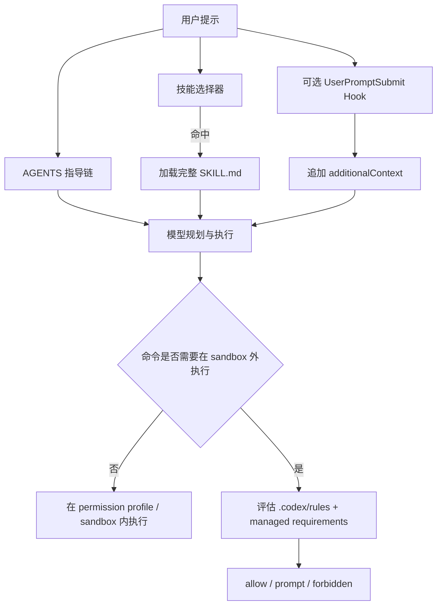

# 在 Codex 中复现 Claude Code 规则文件效果的研究报告

## 执行摘要

结论先行：**Codex 里并不存在一个与 Claude Code `.claude/rules/xxx.md` 一一对应的官方机制。**Anthropic 的 `.claude/rules/*.md` 是一种**模块化的行为指令系统**：文件本体是 Markdown，可选用 YAML frontmatter 的 `paths` 做路径范围限定；无 `paths` 的规则会在会话启动时进入上下文，有 `paths` 的规则只会在 Claude 处理匹配文件时按需加载，而且这些规则本质上仍然是“上下文”，不是硬性强制。OpenAI 的 `.codex/rules/*.rules` 则是**命令执行策略系统**：它当前公开文档化的用途是控制哪些命令可以在 sandbox 外执行，文件格式是 Starlark，核心语义是 `prefix_rule()` 的 `allow / prompt / forbidden` 三态决策。两者在用途、加载点、优先级和安全边界上都不是同一类能力。citeturn24view1turn18view3turn22view4turn12view0turn12view1turn12view2turn25view0

因此，如果你的目标是把 Claude 里“按主题拆分规则、按需生效、团队可共享”的体验迁移到 Codex，**最接近、也最稳妥的做法不是把 Markdown 规则直接改成 `.rules` 文件**，而是采用分层映射：用 `AGENTS.md` 承接“始终生效的项目指导”，用 `.agents/skills/*/SKILL.md` 承接“模块化、按任务加载的专题规则”，把 `.codex/rules/*.rules` 严格限定在“命令权限控制”，只有在确实需要确定性注入、阻断或改写时，才加 `.codex/hooks.json`。这正好对应 Codex 官方文档把定制能力拆成 project guidance、skills、hooks、rules 和 permissions 的方式。citeturn21view3turn33view3turn35view0turn12view0turn17view0turn26view1

基于可维护性、兼容性和安全性，本文的**首选方案**是“`AGENTS.md` + Skills + `.codex/rules` 侧车”的组合；如果你必须保留类似 Claude `paths` frontmatter 的动态选择能力，或者需要 CI/脚本中的**运行时切换**，则建议采用**备选方案**：wrapper 脚本在启动前生成临时 `CODEX_HOME` 与 `AGENTS.override.md`，必要时再叠加 hook 路由。相比之下，直接依赖更低层的 `model_instructions_file` 或非文档化合并语义，虽然可行，但版本敏感性更高，风险也更大。citeturn21view6turn30view1turn29view0turn12view6turn27view0

## 官方机制对照

下表把用户最关心的几个维度并排展开。核心判断只有一句：**Claude 的 rules 更像“上下文级 steering”，Codex 的 `.rules` 更像“客户端侧 exec policy”。**

| 维度         | Claude Code `.claude/rules/*.md`                                                                                                                                               | Codex `.codex/rules/*.rules`                                                                                                                                                                                 | 评估                                            |
| ------------ | ------------------------------------------------------------------------------------------------------------------------------------------------------------------------------ | ------------------------------------------------------------------------------------------------------------------------------------------------------------------------------------------------------------ | ----------------------------------------------- |
| 用途         | 用多个 Markdown 文件组织项目指令；可按路径条件加载，减少上下文噪音。citeturn24view1turn24view0                                                                             | 控制哪些命令可以在 **sandbox 外** 运行；公开文档定位为命令执行策略，非通用提示规则。citeturn12view0turn12view1                                                                                           | **非同类机制**                                  |
| 文件格式     | Markdown；支持 YAML frontmatter，仅文档化了 `paths` 字段。citeturn24view1turn24view2                                                                                       | Starlark；核心结构是 `prefix_rule(pattern, decision, justification, match, not_match)`。citeturn12view1turn12view2turn25view0                                                                           | Claude 偏内容，Codex 偏策略 DSL                 |
| 加载时机     | 无 `paths` 的规则在启动时加载；有 `paths` 的规则仅在 Claude 处理匹配文件时触发，而不是每次工具调用都触发。citeturn24view1                                                   | Codex 在启动时扫描每个 active config layer 旁边的 `rules/` 目录；新增后需重启 Codex。citeturn12view1                                                                                                      | Claude 有“延迟加载”，Codex 没有                 |
| 作用域       | 项目级 `.claude/rules/`、用户级 `~/.claude/rules/`；`.md` 文件递归发现，支持符号链接。citeturn24view0turn24view1                                                           | 用户层 `~/.codex/rules/`、Team Config、受信任项目下的 `<repo>/.codex/rules/`；作用对象是命令前缀匹配。citeturn12view1turn17view1                                                                         | Claude 面向文本指导，Codex 面向命令             |
| 优先级       | 用户级规则先加载，项目级规则后加载，因此项目规则优先；无 `paths` 的 rules 与 `.claude/CLAUDE.md` 同优先级。若规则冲突，Claude 可能任意选择一条。citeturn24view0turn22view4 | 多条匹配规则同时命中时，取**最严格**决策：`forbidden > prompt > allow`；管理员在 `requirements.toml` 里的 `[rules]` 会与普通 `.rules` 合并，仍然按最严格结果生效。citeturn12view1turn13view1turn34view0 | Claude 是“提示优先级”，Codex 是“策略合并优先级” |
| 安全边界     | 官方明确说明：CLAUDE.md / rules 只是上下文，不是硬强制；若必须阻止某动作，应改用 PreToolUse hook 或设置层权限控制。citeturn18view3turn22view4turn23view0                  | `.rules` 属于权限/审批路径的一部分；真正的边界仍由 sandbox、approval policy、permission profiles 与 managed requirements 共同构成。citeturn12view0turn17view0turn26view1turn15view1                    | Codex `.rules` 更“硬”，但只覆盖命令执行面       |
| 当前实现状态 | 官方中文文档稳定公开。citeturn24view1turn23view0                                                                                                                           | 官方明确标注 `.rules` 为 experimental，可能变化。citeturn13view3                                                                                                                                          | Codex 方案需版本治理                            |

这张表也解释了为什么“直接把 `.claude/rules/xxx.md` 改写为 `.codex/rules/xxx.rules`”会失败：**你会把“行为指令”误塞进“命令治理层”。**如果你关心的是代码风格、测试顺序、目录约定、文档同步，这些都应该首先落在 `AGENTS.md`、Skills 或 hook 注入层；如果你关心的是 `git push`、`rm`、`curl`、`gh pr view` 之类命令何时可越过 sandbox，那才是 `.codex/rules/*.rules` 的职责。citeturn21view3turn33view3turn12view0turn12view2

需要特别标注的“**未指定**”或“文档不一致”点有三类。其一，Claude 文档说明了冲突规则下模型可能任意选择，但没有给出更细的冲突求解算法，因此多条 path-scoped 规则同时命中时的精确决策流程属于**未指定**。其二，Codex 官方文档没有给 `.rules` 赋予任何“模型行为提示”语义，因此把 `.rules` 当成通用 prompt 规则使用属于**未指定/不受支持的延伸用法**。其三，OpenAI 文档对 `project_doc_max_bytes` 的表述存在细微不一致：Advanced Config 把它描述为“读取每个 `AGENTS.md` 文件的字节数”，而 AGENTS 指南又说当**组合大小**到达上限时停止追加；实施上应按更保守的“总提示预算”来设计。citeturn22view4turn21view0turn21view4

## 可选实现方案

没有一种单文件方案能完整复刻 Claude rules 的全部语义，所以正确姿势是“按目标能力选工具”。下面四种方案都能落地，但它们分别偏向**常驻指导**、**模块化按需加载**、**确定性路由/拦截**和**运行时切换**。citeturn21view3turn33view3turn35view0turn30view1

**方案甲：用 `AGENTS.md` / `AGENTS.override.md` 承接常驻规则。**  
原理上，它最接近 Claude 中“无 `paths` 的 rules + 目录层级覆盖”的那一半能力。Codex 会从全局 `~/.codex/AGENTS.md` 和项目目录树里的 `AGENTS.md` / `AGENTS.override.md` 组装一条指导链；越靠近当前工作目录的文件越晚拼接，因而优先级越高。它适合迁移那些本来就应该“每次都生效”的规则，比如测试命令、评审要求、目录导航建议、PR 约束。官方还支持 fallback filename，但**每个目录最多只会选一份说明文件**，所以它不能原生替代 `.claude/rules/` 那种“一目录多规则文件”的组织方式。citeturn8view0turn21view3turn21view4turn21view6

**路径与命名建议：**个人偏好放 `~/.codex/AGENTS.md`；仓库通用规范放仓库根 `AGENTS.md`；子域或子系统差异放对应子目录的 `AGENTS.override.md`。如果仓库已经有别的说明文件名，可以通过 `project_doc_fallback_filenames` 加入发现列表，但这只适合“改单文件名”，不适合保留 `.claude/rules/` 的多文件组织。citeturn8view0turn21view6

**加载与解析方式：**Codex 会在每次新会话的第一轮读取 AGENTS 链，并且每次重启 / 新开会话都会重建这条链；文档明确说没有手工 cache 要清。也就是说，这个方案对交互式 CLI、IDE 扩展都很稳妥。citeturn21view0turn21view6turn12view7

**权限与安全边界：**`AGENTS.md` 只是行为指导，不是硬性强制。官方建议把必须执行的规则交给更确定性的基础设施，比如 pre-commit、lint、type-check、hooks 或权限配置。citeturn21view3turn18view3turn22view4

```markdown
# AGENTS.md

## Repository expectations

- 修改 JavaScript / TypeScript 后运行 `pnpm test`
- 变更公共 API 时同步更新 `docs/`
- 新增生产依赖前先说明原因

## Directory routing

- 认证逻辑优先看 `src/auth/`
- 支付逻辑优先看 `services/payments/`
```

```markdown
# services/payments/AGENTS.override.md

## Payments service rules

- 在这个目录里使用 `make test-payments`
- 涉及密钥轮换时只写变更方案，不直接执行
```

**优点**是官方、简单、跨表面一致、维护成本低；**缺点**是没有 Claude `paths` frontmatter 那种 file-glob 条件加载，也不是硬约束。**适用场景**是：你原来的 `.claude/rules/*.md` 大部分本来就是“项目规范说明书”。citeturn21view3turn21view6

**方案乙：用 `.agents/skills/*/SKILL.md` 承接模块化、按任务加载的规则。**  
这是 Codex 里最像“把专题规则拆成多个文件，只有相关时才完整加载”的官方能力。技能的 `SKILL.md` 必须包含 `name` 和 `description`；Codex 在会话开始时只加载技能的名称、描述和路径，真正命中时才读取完整 `SKILL.md`。技能可以显式调用，也可以根据 `description` 隐式触发；如果你不希望隐式触发，还可以在 `agents/openai.yaml` 里把 `allow_implicit_invocation` 设成 `false`。citeturn33view3turn12view5

**路径与命名建议：**当前官方文档使用的是 `.agents/skills`，不是 `.codex/skills`。Codex 会从当前工作目录一直向上扫描到仓库根，再叠加用户、管理员和系统位置。对于跨多个子目录共享、但又不该常驻上下文的规则，这比 `AGENTS.md` 更自然。citeturn33view3

**加载与解析方式：**技能非常适合承载“某类任务才需要”的规则，例如“TypeScript API 变更规范”“数据库迁移审查规范”“前端设计系统约束”。但它的自动触发依据是 `description` 的语义匹配，而不是像 Claude `paths` 那样的显式 glob，因此**它更像按任务匹配，而不是按文件匹配**。citeturn33view3

**权限与安全边界：**技能本身仍是 instructions-first 的机制；如果技能内含 scripts，则这些脚本会进入审批体系，官方审批文档甚至专门列出了 `skill-script approvals` 这一类。换句话说，Skills 可以增强工作流，但不应承担“强制阻止危险动作”的职责。citeturn33view3turn31view4

```markdown
# repo/.agents/skills/ts-api/SKILL.md

---

name: ts-api
description: Use when editing TypeScript API handlers, request validation, OpenAPI comments, or files under src/api.

---

1. 先检查输入校验与错误返回格式。
2. 改动接口时同步更新 OpenAPI 注释。
3. 改完后运行 `pnpm test --filter api`。
4. 若涉及 breaking change，先产出迁移说明。
```

```yaml
# repo/.agents/skills/ts-api/agents/openai.yaml
policy:
  allow_implicit_invocation: true
```

**优点**是模块化、按需加载、上下文友好；**缺点**是原生没有 `paths` frontmatter，隐式触发受描述写法影响。**适用场景**是：你原来的 Claude 规则本质上是“某类任务 playbook”，而不是“所有任务都要记住的底层规范”。citeturn33view3

**方案丙：用 `.codex/hooks.json` + 外部规则注册表做动态注入与确定性拦截。**  
如果你真正想要“只有命中某些路径/行为条件时才把某段规则塞进当前回合”，或者你希望像 Claude 的 hook 一样在执行点前后确定性处理，那么 Codex hooks 是最接近的官方扩展点。Codex hooks 是在固定生命周期点运行的确定性脚本；`UserPromptSubmit` 可以向模型追加 `additionalContext`，`PreToolUse` 可以 block、rewrite 或追加上下文，`SessionStart` 可以注入会话级 developer context。citeturn35view0turn13view4turn13view5

**路径与命名建议：**把 hook 配置放在 `<repo>/.codex/hooks.json` 或 `.codex/config.toml` 的 `[hooks]`，把真正的路由逻辑放在 `<repo>/.codex/hooks/`，再把规则源放在 `<repo>/.codex/rule-registry.yaml` 或同类 YAML/JSON 文件中。这样可以把“规则内容”和“路由逻辑”分离。citeturn35view0

**加载与解析方式：**这是最灵活、也最工程化的方案。要注意两点：第一，`UserPromptSubmit` 的 matcher 当前**不生效**，所以你不能靠 `hooks.json` 里的 matcher 做 prompt 路由，必须在脚本里自己读入 `prompt` 字段判断。第二，`PreToolUse` 虽然能拦截 Bash、`apply_patch` 与 MCP 调用并可返回 `additionalContext` / deny / rewrite，但官方明确说它**还不是完整 enforcement boundary**，并不覆盖所有 shell 路径，也不覆盖 `WebSearch` 等非 shell 工具。citeturn13view5turn12view4turn13view4

**权限与安全边界：**非托管 command hook 需要先 review/trust；Codex 以 hook 定义的 hash 记录信任，变更后要重新审查。多个匹配 hook 会并发启动，因此不要把“执行顺序”当成已文档保证。citeturn35view0

```json
{
  "hooks": {
    "UserPromptSubmit": [
      {
        "hooks": [
          {
            "type": "command",
            "command": "python3 \"$(git rev-parse --show-toplevel)/.codex/hooks/route_rules.py\""
          }
        ]
      }
    ],
    "PreToolUse": [
      {
        "matcher": "^(Bash|apply_patch|Edit|Write)$",
        "hooks": [
          {
            "type": "command",
            "command": "python3 \"$(git rev-parse --show-toplevel)/.codex/hooks/enforce_rules.py\"",
            "timeout": 30,
            "statusMessage": "Routing contextual rules"
          }
        ]
      }
    ]
  }
}
```

```yaml
# .codex/rule-registry.yaml
rules:
  - id: api_ts
    match:
      prompt_regex: "(API|handler|OpenAPI|endpoint)"
      cwd_glob: "src/api/**"
    inject_markdown: |
      - 所有端点必须做输入校验
      - 错误响应必须遵循统一格式
      - 修改接口时同步更新 OpenAPI 注释

  - id: forbid_push
    match:
      bash_prefix: ["git", "push"]
    decision: deny
    reason: "推送需要人工审批"
```

```python
# 伪代码：route_rules.py
payload = read_json(stdin)
rules = load_yaml(".codex/rule-registry.yaml")

matched = []
for rule in rules:
    if prompt_and_cwd_match(rule, payload):
        matched.append(rule["inject_markdown"])

print_json({
    "hookSpecificOutput": {
        "hookEventName": "UserPromptSubmit",
        "additionalContext": "\n\n".join(matched)
    }
})
```

**优点**是最接近 Claude `paths` 的“条件生效”体验，还能附带硬拦截；**缺点**是工程复杂、需要 trust 流程、并有拦截覆盖面限制。**适用场景**是：你确实需要按路径/回合/工具事件做精准路由，而且愿意为此维护一层脚本。citeturn35view0turn13view4turn13view5

**方案丁：用 wrapper 脚本在运行时生成临时 `CODEX_HOME` 和 `AGENTS.override.md`。**  
如果你的真实诉求是“像 Claude 那样在不同场景一键切换不同规则集”，而不是让 Codex 自己理解路径 frontmatter，那么最实用的迁移桥接方案其实是：**在启动前由 wrapper 决定规则集，然后生成一个临时的全局 override。**Codex 官方支持 `~/.codex/AGENTS.override.md` 作为“临时覆盖用的全局指导”，也支持通过 `CODEX_HOME` 指向不同的 home 目录；另外，CLI 的 `--profile` 和 `-c/--config` 覆盖具有更高优先级，因此非常适合脚本化启动。citeturn21view6turn30view1turn30view3

**路径与命名建议：**保留你的源规则库在仓库里，比如 `rules-src/`、甚至继续保留 `.claude/rules/` 作为迁移期输入，然后由 `tools/codex-with-rules.sh` 或 `tools/build_codex_override.py` 生成临时 `AGENTS.override.md`。这是一条很好的“过渡桥”，因为它允许你先不重写全部规则。citeturn21view6

**加载与解析方式：**wrapper 的算法完全由你自己定义：你可以按命令参数、目录、CI stage、git branch，甚至环境变量来选规则集。Codex 只负责加载结果文件，不负责你如何选。换言之，**选择器逻辑属于你自己的实现，官方未指定**。citeturn21view6turn30view1

**权限与安全边界：**这个方案本质上还是 prompt-level 指导，不是 enforcement。它适用于“评审模式”“迁移模式”“文档模式”这类一键切换；如果要阻止真实危险动作，仍应叠加 permission profiles、`.codex/rules` 或 hooks。配置参考里确实还有 `developer_instructions` 与 `model_instructions_file` 两个更低层入口，但前者是“额外 developer instructions”，后者是“替代内建 instructions 的文件”；后者在 2026 年曾出现过 `codex exec --profile` 下被忽略的公开 issue，因此不建议把它作为默认基座。citeturn29view0turn12view6turn27view0turn17view0turn26view1

```bash
#!/usr/bin/env bash
set -euo pipefail

RULESET="${1:-review}"
shift || true

BASE_HOME="${CODEX_HOME:-$HOME/.codex}"
TMP_HOME="$(mktemp -d)"
trap 'rm -rf "$TMP_HOME"' EXIT

# 复用你的基础配置
if [ -f "$BASE_HOME/config.toml" ]; then
  ln -s "$BASE_HOME/config.toml" "$TMP_HOME/config.toml"
fi

# 生成当前调用专属的指导文件
python3 tools/build_codex_override.py \
  --source .claude/rules \
  --mode "$RULESET" \
  > "$TMP_HOME/AGENTS.override.md"

CODEX_HOME="$TMP_HOME" exec codex "$@"
```

**优点**是最适合运行时切换和迁移桥接；**缺点**是审计链条更分散，团队共享与治理都比纯官方目录结构更费心。**适用场景**是：你已有大量 `.claude/rules/*.md`，希望先低成本桥接，再逐步收敛到 AGENTS/skills/hook 的标准化结构。citeturn21view6turn30view1turn29view0

下表汇总这些方案的关键属性。这里的“实现难度 / 灵活性 / 安全性 / 兼容性 / 维护成本”是基于上文官方能力边界做出的分析性判断，不是厂商原文评级。citeturn21view3turn33view3turn35view0turn12view0

| 方案                                               | 实现难度 | 灵活性 | 安全性 | 兼容性 | 维护成本 | 最适合承接的 Claude rules 能力      |
| -------------------------------------------------- | -------- | ------ | ------ | ------ | -------- | ----------------------------------- |
| `AGENTS.md` / `AGENTS.override.md`                 | 低       | 中     | 中     | 高     | 低       | 无 `paths` 的常驻项目规则           |
| `.agents/skills/*/SKILL.md`                        | 中       | 高     | 中     | 高     | 中       | 模块化、按任务加载的专题规则        |
| `.codex/hooks.json` + 注册表                       | 高       | 很高   | 高     | 中     | 高       | 近似 `paths` 的条件注入、执行点阻断 |
| wrapper + 临时 `CODEX_HOME` / `AGENTS.override.md` | 中高     | 很高   | 中     | 中     | 中高     | 运行时切换、迁移桥接、CI persona    |

## 推荐架构

我的**首选推荐**是采用一个明确分层的组合架构，而不是赌某个单点机制能“一招通吃”。具体做法是：**用 `AGENTS.md` 负责基线指导，用 Skills 负责模块化专题规则，用 `.codex/rules/*.rules` 负责命令权限，只有在“目录/扩展名/时机”这类官方未直给的能力上再补 hook。**这套分层架构与 Codex 官方的 capability map 是一致的，而且能够把“提示治理”和“权限治理”清楚分开。citeturn21view3turn33view3turn12view0turn35view0turn17view0



这个推荐架构背后的映射关系，可以概括为下面这张“迁移对照表”。

| Claude 里的原始需求                        | Codex 推荐落点                                          | 原因                                                 |
| ------------------------------------------ | ------------------------------------------------------- | ---------------------------------------------------- |
| 所有任务都应遵守的项目规则                 | `AGENTS.md`                                             | 官方 project guidance，启动前生效，跨 CLI/IDE 一致   |
| 只对某个子目录/子系统生效                  | 该目录的 `AGENTS.override.md`                           | 原生支持目录链式覆盖                                 |
| 只在某类任务/主题下才加载                  | `.agents/skills/*/SKILL.md`                             | 元数据常驻，完整内容按需加载                         |
| 必须在执行点阻止/改写                      | `.codex/hooks.json`                                     | 确定性脚本，支持 block / rewrite / additionalContext |
| 必须控制越过 sandbox 的命令                | `.codex/rules/*.rules` 或 `requirements.toml` `[rules]` | 正是官方规则系统的职责                               |
| 需要在不同 persona / CI stage 间切换规则集 | wrapper + `CODEX_HOME` + 临时 `AGENTS.override.md`      | 官方支持的运行时桥接方式                             |

我的**备选推荐**只在两种条件下成立：第一，你现有 `.claude/rules/*.md` 很多，短期不想重构；第二，你的使用场景高度脚本化，需要“同一仓库、不同调用、不同规则集”。在这种情况下，wrapper 桥接是最现实的过渡路径。但长期看，仍应把常驻规则收敛进 `AGENTS.md`，把专题规则收敛成 Skills，把硬约束收敛到 permissions / `.rules` / hooks，否则治理会持续分散。citeturn21view6turn33view3turn35view0turn17view0

## 实施与迁移

落地时，建议不要按“文件后缀替换”来迁移，而是按**规则意图分类**来迁移。最稳妥的切法，是先把你现有的 `.claude/rules/*.md` 分成四类：常驻规则、目录规则、专题规则、硬约束规则。前两类优先归并到 `AGENTS.md` / `AGENTS.override.md`；第三类改造成 Skills；第四类改造成 `.codex/rules/*.rules`、permission profiles 或 hook。这个拆分方式既符合官方边界，也最容易做灰度。citeturn24view1turn21view3turn33view3turn12view0turn17view0

| 阶段       | 动作                                                                                    | 产物                                               | 验证方式                                                                    |
| ---------- | --------------------------------------------------------------------------------------- | -------------------------------------------------- | --------------------------------------------------------------------------- |
| 盘点       | 逐个审阅现有 `.claude/rules/*.md`，给每条规则标注“常驻 / 目录 / 专题 / 硬约束”          | 一份迁移分类表                                     | 由负责人人工抽样复核                                                        |
| 基线落地   | 建根 `AGENTS.md`，把仓库级规则并入；对子目录创建 `AGENTS.override.md`                   | `AGENTS.md`、若干 `AGENTS.override.md`             | 运行 `codex --ask-for-approval never "Summarize the current instructions."` |
| 模块化落地 | 把专题规则改成 `.agents/skills/*/SKILL.md`，写清楚 `description` 的触发边界             | 若干 Skills                                        | 显式调用技能，或用匹配提示测试是否隐式触发                                  |
| 权限落地   | 将命令审批/禁止规则写入 `.codex/rules/default.rules`；必要时配自定义 permission profile | `.codex/rules/default.rules`、`.codex/config.toml` | 运行 `codex execpolicy check --pretty`                                      |
| 条件路由   | 对不能用目录和 Skills 表达的 `paths` 需求，补一层 hook + YAML 注册表                    | `.codex/hooks.json`、hook 脚本、规则注册表         | 用 JSON fixture 单测脚本，再做交互式集成测试                                |
| 灰度发布   | 先对一个子仓库或一个团队启用，再扩到整个仓库                                            | 一版可回滚的最小实现                               | 观察一周误触发、漏触发、审批噪音                                            |

在目录布局上，我建议最终收敛到下面这种结构。它能把“指导”“技能”“权限”“自动化”四层区分得很清楚：

```text
repo/
├── AGENTS.md
├── services/
│   └── payments/
│       └── AGENTS.override.md
├── .agents/
│   └── skills/
│       ├── ts-api/
│       │   └── SKILL.md
│       └── migration-review/
│           └── SKILL.md
└── .codex/
    ├── config.toml
    ├── rules/
    │   └── default.rules
    └── hooks.json
```

如果你还处在迁移前期，不想一次性重写全部内容，那么可以采用“两步法”。第一步，先把现有 `.claude/rules/*.md` 当作**源规则库**，由 wrapper 在运行时拼成临时 `AGENTS.override.md`；第二步，再把使用频率最高、最稳定的部分收敛成 `AGENTS.md` 和 Skills。这会比“一次性重构所有规则文件”更稳，也更容易回滚。citeturn21view6turn30view1

还有一个实施细节必须提前说明：在默认 `:workspace` / `workspace-write` 安全模型里，仓库下的 `.codex` 与 `.agents` 目录是受保护的只读路径。也就是说，不要把“让 Codex 自己维护 `.codex/hooks.json` 或 `.agents/skills`”当成默认前提；这些文件更适合由人、CI 引导脚本，或经明确授权的 bootstrap 步骤来建立。citeturn26view1turn26view0

## 风险、测试与回滚

下面先给出核心风险表。这里混合使用了官方文档和 openai/codex 官方仓库 issue；其中 issue 只用来提示**兼容性风险**，不作为规范本身。citeturn13view3turn35view0turn27view0turn27view1turn27view2turn27view3turn27view4

| 风险            | 触发条件                                                      | 影响                                      | 缓解措施                                                                                   | 依据                                                               |
| --------------- | ------------------------------------------------------------- | ----------------------------------------- | ------------------------------------------------------------------------------------------ | ------------------------------------------------------------------ |
| 软规则不稳定    | 仅依赖 `AGENTS.md` 或 Skills 约束必须执行的动作               | 规则会被偶发忽略                          | 把必须执行/必须禁止的事项下沉到 hook、permission profile、`.rules`、lint、pre-commit       | citeturn21view3turn18view3turn22view4                         |
| 权限语义混淆    | 把 `.codex/rules` 当成通用行为规则使用                        | 写对了策略，错了层级；风格/流程规则不生效 | 明确规定：`.rules` 只管命令越过 sandbox 的审批/禁止                                        | citeturn12view0turn12view2turn17view0                         |
| 用户级策略漂移  | Smart approvals 把允许规则写入 `~/.codex/rules/default.rules` | 同一用户会逐渐积累更宽松的本机 allowlist  | 定期审计 `~/.codex/rules/default.rules`；关键 deny/prompt 放进 managed `requirements.toml` | citeturn12view1turn34view0                                     |
| hook 覆盖面不足 | 依赖 `PreToolUse` 做完整拦截                                  | 某些 shell 路径或 `WebSearch` 不被拦截    | 把 hooks 当“补充控制”，不是唯一边界；基础边界仍靠 sandbox / profiles                       | citeturn13view4turn26view1                                     |
| hook 行为并发   | 多个 matching hooks 同时存在                                  | 依赖执行顺序会失效                        | 单事件只保留一个“路由 hook”；在脚本内部串行调度                                            | citeturn35view0                                                 |
| 上下文/性能压力 | AGENTS 太长、技能太多                                         | 首轮上下文臃肿，技能元数据被截短或省略    | 控制 AGENTS 大小；技能描述短而准；把大规则拆成 Skills                                      | citeturn21view4turn33view3                                     |
| 文档歧义        | `project_doc_max_bytes` 的“每文件/总链路”表述不一致           | 误判可加载体量                            | 按更严格的总预算设计，并用实际会话日志验证                                                 | citeturn21view0turn21view4                                     |
| 版本/平台不一致 | profile、hooks、symlink、Windows App 等边缘组合               | 某些高级方案在特定版本失效或表现异常      | 固定 Codex 版本；在 CLI、IDE、Windows/WSL2 上分别验收；优先使用更基础的 AGENTS + Skills    | citeturn27view0turn27view1turn27view2turn27view3turn27view4 |

测试与验证上，我建议把“功能验证”和“兼容性验证”拆开。功能验证关注规则有没有被看到、有没有在对的时候触发；兼容性验证关注 CLI / IDE / `codex exec` / Windows / WSL2 有没有表现差异。官方已经给出了不少适合当 smoke test 的命令。citeturn21view5turn21view6turn25view4turn35view0

| 测试项        | 方法                                                                                               | 期望结果                                                 |
| ------------- | -------------------------------------------------------------------------------------------------- | -------------------------------------------------------- |
| AGENTS 加载   | `codex --ask-for-approval never "Summarize the current instructions."`                             | 输出能复述根 `AGENTS.md` 关键条目                        |
| 子目录覆盖    | `codex --cd services/payments --ask-for-approval never "List the instruction sources you loaded."` | 可以看到根文件与子目录 override 的顺序                   |
| 技能显式触发  | 在提示里显式提 `$ts-api` 或 `/skills` 选择                                                         | 能进入完整技能流程                                       |
| 技能隐式触发  | 用包含 `description` 关键词的任务提示测试                                                          | 相关场景下能自动命中；无关场景不误触发                   |
| `.rules` 决策 | `codex execpolicy check --pretty -r .codex/rules/default.rules -- git push origin main`            | 返回 `prompt` 或 `forbidden`，并显示命中的 justification |
| hook 路由     | 先用 JSON fixture 单测 hook 脚本，再做真实提示测试                                                 | 命中条件时追加 `additionalContext` 或正确 block          |
| 日志审计      | 启用 `-c log_dir=./.codex-log` 后检查 `codex-tui.log` / session jsonl                              | 能回溯实际加载源和触发路径                               |
| 兼容性验证    | 分别在交互式 CLI、IDE 扩展、`codex exec` 跑一遍                                                    | 行为一致；若不一致，记录版本与平台并降级方案             |

回滚策略建议做成“三层开关”，这样出问题时不用整仓库返工。第一层，**关闭自动化增强层**：对 hooks，直接在用户配置里设 `[features].hooks = false`，或临时移走 `.codex/hooks.json`；对 wrapper，停止使用 wrapper，回到原始 `codex` 命令。第二层，**关闭模块层**：对 Skills，可用 `[[skills.config]] path=... enabled=false` 逐个禁用；对某个目录的 `AGENTS.override.md`，删除或重命名即可恢复到上层规则。第三层，**关闭权限层**：移走 `.codex/rules/*.rules`，或在企业环境里用 managed requirements 接管限制。由于 Codex 会在每次新会话重建 AGENTS 链和配置层，所以回滚不需要清缓存；只要新开会话即可观察结果。citeturn35view0turn33view3turn21view6turn12view1turn34view0

最后给一个简洁判断：如果你追求的是**“像 Claude 那样把行为规则拆成多个 Markdown 文件”**，请优先想到 `AGENTS.md` 与 Skills；如果你追求的是**“像策略引擎那样限制命令权限”**，请使用 `.codex/rules/*.rules` 与 permission profiles；如果你追求的是**“像 `paths` frontmatter 那样条件生效”**，那是 hook 或 wrapper 的舞台，而不是 `.rules` 的舞台。把这三层分清楚，Codex 里就能得到比“一对一硬仿”更稳定、也更安全的实现。citeturn21view3turn33view3turn12view0turn35view0turn17view0
