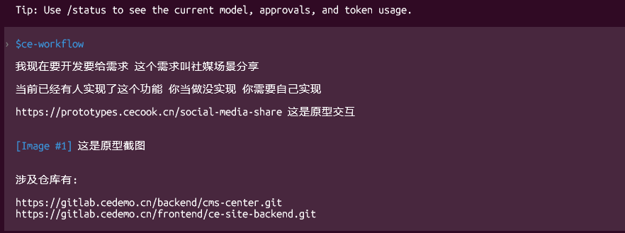
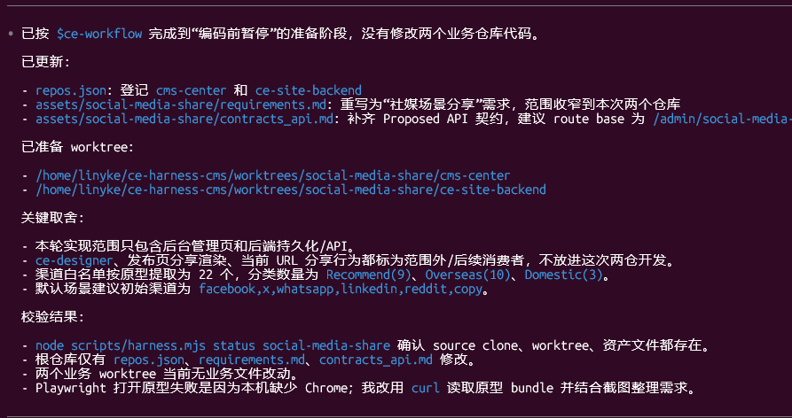
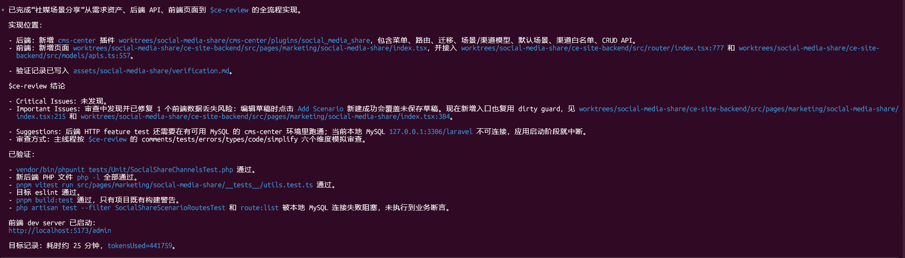
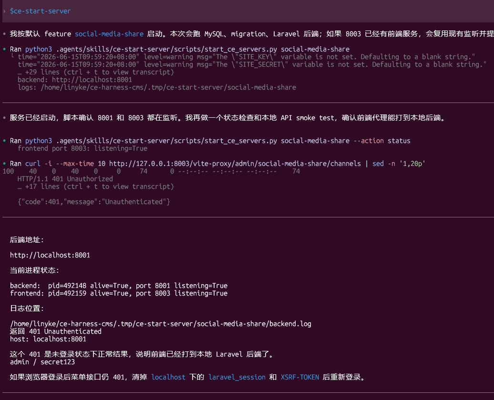
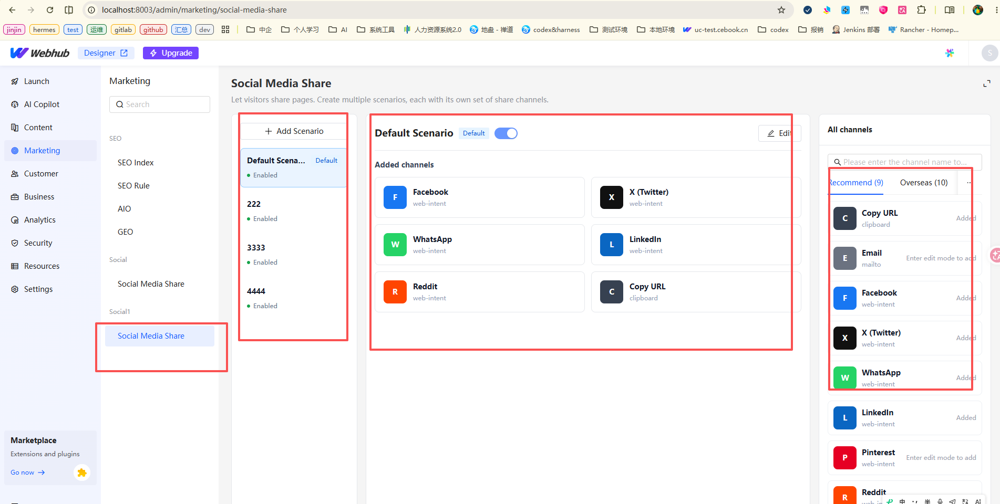
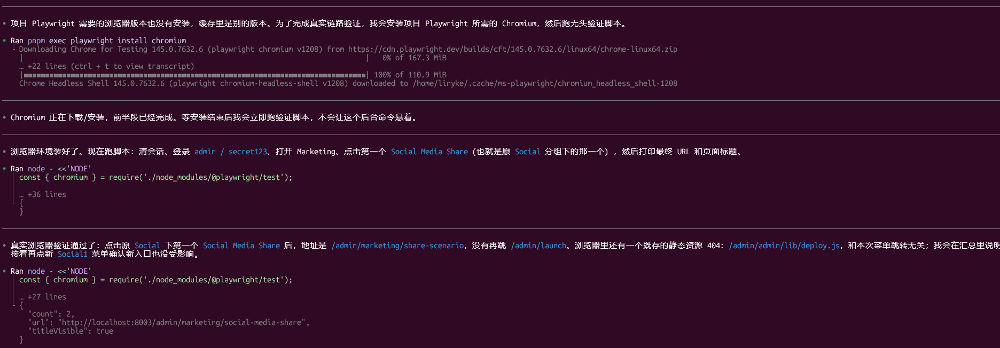
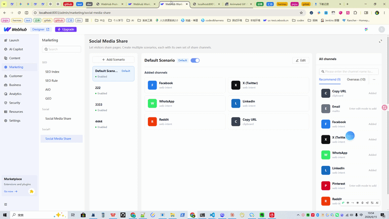

**CE Workflow 功能开发流程复盘**

**1. 需求启动**

新功能进入 CE workflow 后，首先确定以下信息：

- 功能名称
- feature slug
- 涉及仓库
- 原型、截图、接口说明、已有实现线索
- 前后端职责边界
- 验收标准

**比如可以这样开启一段需求:**



工作区结构：

```text
projects/<repo>                  # 长期 source clone
worktrees/<feature>/<repo>       # feature 独立 worktree
assets/<feature>/                # 长期需求、计划、验证、排障资产
```

**2. 需求与契约沉淀**

实现前先产出两类文档：

```text
assets/<feature>/requirements.md
assets/<feature>/contracts_api.md
```

`requirements.md` 记录：

- 功能目标
- 涉及仓库
- 现有系统事实
- 范围内 / 范围外
- 验收标准
- 验证计划
- 假设与待确认问题

`contracts_api.md` 记录：

- HTTP API
- request / response 示例
- 错误码
- 数据模型
- 跨仓库依赖
- 兼容策略

这个阶段重点是确认需求和接口契约，不直接写业务代码。

**这步会stop.然后生成一个report,如下:**



**3. 实施计划**

需求和契约确认后，生成实施计划：

```text
assets/<feature>/plan-YYYY-MM-DD-<topic>.md
```

计划内容包括：

- 后端任务
- 前端任务
- migration / seed / 权限 / 菜单任务
- 测试任务
- 联调任务
- 风险点
- 验证命令

实施计划确认后再进入编码。

**4. 功能实现**

后端通常涉及：

- route
- controller
- request validation
- service
- model
- migration
- permission / menu code
- PHPUnit tests

前端通常涉及：

- route
- page
- API client
- state / hooks
- interaction
- unit tests
- menu code 映射

业务代码必须在对应子仓库里修改，并分别检查状态：

```bash
git -C worktrees/<feature>/cms-center status --short --branch
git -C worktrees/<feature>/ce-site-backend status --short --branch
```

**开发完成后 ce-workflow 给出的一个report**


**5. 本地服务启动**

进入联调阶段后，通过 `ce-start-server` 统一启动本地环境。

**效果如图:**



目标动作：

```bash
docker compose up -d mysql
php artisan migrate
php artisan serve --host=0.0.0.0 --port=8001
pnpm dev
```

前端 `.env/.env` 应指向本地后端：

```env
VITE_API_BASE_URL=http://localhost:8001
```

本地访问地址：

```text
Admin：http://localhost:8003/admin
Backend：http://localhost:8001
```

**本地浏览的效果**:



**6. 自动化验证**

通过 `Playwright` mcp来进行browser use.模拟人的真实点击行且:

**效果如图:**



## 其他方式的验证

### 后端自动化验证

```bash
cd worktrees/<feature>/cms-center

php artisan migrate # 数据库迁移验证
php artisan route:list | rg "<feature>" # 路由注册验证
php artisan test tests/Feature/<Feature> # 后端 Feature Test / 功能测试 / 接口级测试
php artisan test tests/Unit/<Feature> # 后端 Unit Test / 单元测试
```

### 前端自动化测试与静态检查

```bash
cd worktrees/<feature>/ce-site-backend

pnpm exec eslint src --ext .ts,.tsx #  静态代码检查
pnpm exec vitest run <相关测试文件>  # 前端单元测试 / 组件测试
pnpm build:dev #  构建验证
```

### 接口冒烟验证/API smoke test：

```bash
curl -c /tmp/ce-cookie.txt -b /tmp/ce-cookie.txt \
  http://127.0.0.1:8003/vite-proxy/sanctum/csrf-cookie

curl -c /tmp/ce-cookie.txt -b /tmp/ce-cookie.txt \
  -H 'Content-Type: application/json' \
  -X POST http://127.0.0.1:8003/vite-proxy/admin/users/login \
  --data '{"username":"admin","password":"secret123"}'

curl -b /tmp/ce-cookie.txt \
  http://127.0.0.1:8003/vite-proxy/admin/<feature-api>
```

**7. 浏览器手动验证**

**效果如图:**



交付时应提供明确手测清单：

```text
测试地址：
http://localhost:8003/admin

登录账号：
admin / secret123

测试路径：
1. 打开目标菜单
2. 进入功能页面
3. 执行新增
4. 执行编辑
5. 执行删除
6. 刷新页面验证数据持久化
7. 检查 Network 请求状态
8. 检查异常状态和权限表现
```

Network 检查应列出具体接口：

```text
GET /admin/<feature>/list       200
POST /admin/<feature>           200
PUT /admin/<feature>/{id}       200
DELETE /admin/<feature>/{id}    200
```

**8. 验证沉淀**

开发完成后写入：

```text
assets/<feature>/verification.md
```

内容包括：

- 服务启动情况
- migration 执行结果
- 后端测试结果
- 前端测试结果
- API 验证结果
- 浏览器验证结果
- 已知问题- 未验证项

如果过程中发生排障，还需要写：

```text
assets/<feature>/debug-YYYY-MM-DD-<topic>.md
```

**9. 流程优势**

- 多仓库隔离清晰，避免污染 source clone
- 需求、契约、计划、验证都有长期资产
- 前后端 API 契约可追踪
- 本地服务启动流程标准化
- 测试和浏览器验证有明确证据
- 排障经验可以沉淀复用
- 避免“只写代码、不建表、不起服务、不验证”的问题

**10. 当前待改进点**

- `ce-start-server` 需要继续增强端口冲突处理
- 登录账号 seed 需要标准化
- 浏览器 e2e 可进一步自动化
- `verification.md` 可模板化
- 菜单 / permission / route code 的契约检查可自动化
- 本地 `.env` 检查可以在启动前强制执行
- API curl 验证可以按 `contracts_api.md` 自动生成

**总结**

CE workflow 的标准闭环是：

```text
需求进入
→ 创建 feature worktree
→ 需求文档
→ API 契约
→ 实施计划
→ 编码实现
→ 本地服务
→ 自动化测试
→ API 验证
→ 浏览器验证
→ verification/debug 沉淀
→ 准备提交或 MR
```

---

## **通过社媒场景分享的功能实践后的复盘结果**

[社媒分享](./Scenario.md)

## 当前的ce-workflow的skills基本讲解

[技能包](./ce-workflow-skills.md)
