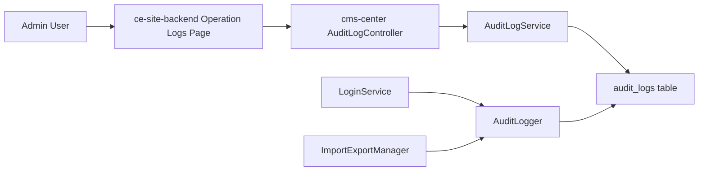

# Operation Logs 技术方案

日期：2026-06-26  
范围：`cms-center` + `ce-site-backend`  
状态：Demo 方案已实现，仍需按目标环境补充真实业务导入/导出数据验证。

## 1. 汇报摘要

本方案把 Operation Logs 定位为一套独立的审计日志能力，而不是依赖 Sentry 或前端埋点。核心思路是：`cms-center` 作为业务事实发生方负责写入和查询审计日志，`ce-site-backend` 作为管理端前端负责展示、筛选和统计。

本次 demo 先覆盖四个高价值动作：

- `logged_in`：管理员登录成功。
- `logged_out`：管理员登出成功。
- `imported`：导入任务创建成功。
- `exported`：导出任务创建成功。

选择这四个动作的原因是它们横跨安全和数据流转场景，风险高、价值明确，并且能够通过少量稳定切点验证整条链路：写入、查询、展示、筛选、统计。

## 2. 背景和问题

PRD 希望在 CMS Center 的 CRUD、登录登出、导入导出等场景记录操作日志。最直接的做法是在每个业务 Controller 或 CRUD 方法里手写日志，但这个方案会带来几个问题：

- 重复代码多，后续扩展到全量 CRUD 时维护成本高。
- 不同业务模块容易出现字段不一致、日志语义不一致。
- 直接在业务主流程写日志，如果异常处理不当，可能影响用户正常操作。
- 只依赖 Sentry 这类观测平台，难以满足后台页面的筛选、分页、权限和长期审计要求。

因此本 demo 不从“所有代码都打点”开始，而是先抽象出稳定的审计日志基础设施，再在登录、登出、统一导入导出服务这些稳定边界上接入。

## 3. 方案选择

### 3.1 推荐方案：后端审计日志服务 + 稳定业务边界埋点

由 `cms-center` 新增 `audit_logs` 表、`AuditLogger` 写入服务、`AuditLogService` 查询服务和 `AuditLogController` 接口。业务模块只调用 `AuditLogger::record()`，不直接关心表结构。

优点：

- 日志数据是业务系统内的一等数据，可分页、筛选、统计和授权。
- 写入逻辑统一，字段结构一致。
- `AuditLogger` 捕获写入异常，只记录 warning，不阻断主业务流程。
- 后续扩展 CRUD、审批、配置变更等动作时，只需要复用同一套写入协议。

缺点：

- 仍然需要在关键业务边界接入少量代码。
- 如果要做到完整 CRUD 自动化，需要后续定义更清晰的模型事件、Request 中间件或领域事件规范。

### 3.2 不推荐把 Sentry 作为 Operation Logs 主数据源

Sentry 更适合错误监控、性能追踪和异常诊断，不适合作为后台审计日志的主存储。

主要原因：

- Sentry 的数据模型围绕 error/event/trace，不是围绕 operator/action/target/result。
- 查询、分页、字段筛选、租户隔离、权限控制不适合直接支撑后台审计页面。
- 数据保留策略、采样策略和成本模型不一定满足审计需求。
- 用户成功操作通常不是异常事件，强行写入 Sentry 会污染监控信号。

可保留的用法：当审计日志写入失败时，后端可以通过 Laravel log 或 Sentry warning 记录异常，辅助排障；但 Operation Logs 页面不应以 Sentry 作为数据源。

### 3.3 “完全不改业务代码”的可行性判断

完全不改业务代码就记录所有操作，在当前系统里不现实。原因是通用 middleware 只能看到 HTTP 请求，无法准确知道业务动作是否真正成功、目标对象是什么、导入导出任务 ID 是什么、异步任务是否创建成功。

后续如果要减少业务侵入，可以按层级推进：

- 对标准 CRUD：封装 BaseController / Service 层事件，统一在成功后发领域事件。
- 对模型变更：使用 Eloquent observer 记录 create/update/delete，但需要补 actor、route、业务名和字段 diff。
- 对导入导出：继续放在 `ImportExportManager` 这种统一服务边界，不下沉到每个业务 Controller。
- 对登录登出：保持在认证服务边界，保证 actor 和 guard 信息准确。

## 4. 总体架构



职责划分：

- `cms-center`：负责审计日志表结构、写入服务、查询聚合接口和业务切点。
- `ce-site-backend`：负责页面展示、筛选控件、列表分页和 Overview 统计视图。
- MySQL：持久化审计日志；实际表名受 `DB_PREFIX` 影响，本地表现为 `cms_audit_logs`。

## 5. 后端设计

### 5.1 数据模型

新增表：`audit_logs`

核心字段：

| 字段 | 说明 |
| --- | --- |
| `site_id` | 站点 / 租户 ID，兼容当前 binary UUID 存储方式 |
| `actor_id` | 操作者 admin user ID |
| `actor_name` / `actor_username` | 操作者展示信息 |
| `action` | 操作类型，例如 `logged_in`、`logged_out`、`imported`、`exported` |
| `application` | 来源模块，例如 `Security`、`customer`、`member`、低代码应用模块 |
| `target_type` | 目标类型，例如 `admin_user`、`job_record` |
| `target_id` / `target_name` | 目标对象 ID 和名称 |
| `result` | 操作结果，当前 demo 主要写 `success` |
| `content` | 操作摘要 |
| `metadata` | JSON 扩展信息，例如导入导出 handler、fields、mapping、record id |
| `ip_address` / `user_agent` | 请求环境 |
| `request_id` | 请求关联 ID，无传入时自动生成 |
| `occurred_at` | 业务发生时间 |

索引设计：

- `site_id + occurred_at`：支撑租户维度时间倒序查询。
- `action + occurred_at`：支撑 action 筛选。
- `actor_id + occurred_at`：支撑操作人查询。
- `application + occurred_at`：支撑模块维度查询。
- `request_id`：支撑排障关联。

### 5.2 写入服务

新增 `App\Services\AuditLogger`，对业务侧暴露：

```php
record(array $payload): void
```

设计原则：

- 业务方只传 action、application、target、content、metadata 等语义字段。
- `AuditLogger` 自动补充当前 admin user、site_id、IP、User-Agent、request_id、occurred_at。
- `site_id` 做安全转换：支持 binary UUID、标准 UUID 字符串；空值或非法值降级为 null。
- 写入失败不影响主流程，只记录 warning，避免“日志系统故障导致登录/导入/导出失败”。

### 5.3 埋点位置

登录成功：

- 文件：`app/Services/LoginService.php`
- 切点：`Auth::guard('admin')->login($user)` 成功后。
- action：`logged_in`
- application：`Security`
- target：`admin_user`

登出成功：

- 文件：`app/Services/LoginService.php`
- 切点：登出前保存当前 user，`logout()` 后写日志。
- action：`logged_out`
- application：`Security`
- target：`admin_user`

导出任务创建：

- 文件：`app/Support/ImportExportManager.php`
- 切点：`JobRecord` 和 `ImportExportRecord` 创建成功后、`ExportJob::dispatch()` 前。
- action：`exported`
- target：`job_record`
- metadata：handler、fields、params、import_export_record_id。

导入任务创建：

- 文件：`app/Support/ImportExportManager.php`
- 切点：`JobRecord` 创建成功并绑定上传记录后、`ImportJob::dispatch()` 前。
- action：`imported`
- target：`job_record`
- metadata：handler、file_id、mapping、import_export_record_id。

这里记录的是“任务创建成功”，不是异步 job 最终执行成功。后续如需区分最终成功 / 失败，可以在 ImportJob / ExportJob 完成后补充状态更新或追加日志。

### 5.4 查询接口

新增 Controller：`App\Http\Controllers\Admin\V1\AuditLogController`

接口：

| Method | Path | 说明 |
| --- | --- | --- |
| GET | `/admin/audit-logs/overview` | 获取总量、action 分布、application 排名、operator 排名 |
| GET | `/admin/audit-logs` | 获取日志分页列表 |
| GET | `/admin/audit-logs/exports` | 获取导出类日志分页列表，服务端固定筛选 `action=exported` |

查询参数：

| 参数 | 说明 |
| --- | --- |
| `date_range` | `all` / `today` / `last_7_days` / `last_30_days` / `custom` |
| `start_at`, `end_at` | 自定义时间范围 |
| `actor_id` | 操作者 ID |
| `action` | 操作类型，支持逗号分隔 |
| `application` | 来源模块 |
| `result` | 结果 |
| `keyword` | 模糊匹配 target name、target id、content |
| `page`, `per_page` | 分页，`per_page` 最大 100 |

响应沿用现有后台接口风格：

```json
{
  "code": 200,
  "message": "success",
  "data": {}
}
```

## 6. 前端设计

### 6.1 API 模块

新增目录：

```text
src/api/safety/operationLogs/
```

主要文件：

- `urls.ts`：维护接口路径。
- `operationLogs.types.ts`：维护请求和响应 DTO。
- `getAuditLogOverview.ts`：Overview hook。
- `getAuditLogs.ts`：Record 列表 hook。
- `getAuditLogExports.ts`：Export 列表 hook。
- `index.ts`：统一导出。

### 6.2 页面结构

新增页面：

```text
src/pages/safety/operation-logs/
```

页面入口：

```text
Security -> System Security -> Operation Logs
```

实际路由：

```text
/admin/security/operation-logs
```

页面包含三个 tab：

- `Overview`：总数、四类 action 数量、application 排名、operator 排名。
- `Record`：完整日志列表，支持时间、action、关键词筛选。
- `Export`：导出日志列表，只展示 `exported`。

表格字段：

- Operator
- Action
- Application
- Target
- Time
- Result
- Content

## 7. 菜单和权限

后端菜单配置在 `config/menus/safety.php` 中新增：

```text
Security
  System Security
    Operation Logs
```

新增 menu code：

- `system_security_system_security`
- `system_security_operation_logs`

前端路由 name 与菜单 code 对齐：

```text
system_security_operation_logs
```

本地或部署后需要执行菜单同步命令，使配置写入菜单表并刷新后台菜单缓存。

## 8. 测试和验证

已完成的自动化验证：

- 后端 focused feature test：`AuditLogFeatureTest` 通过，覆盖 9 个测试、23 个断言。
- 后端 route 验证：`admin/audit-logs` 下 3 个接口存在。
- 后端 PHP 语法检查：涉及文件通过 `php -l`。
- 前端 targeted eslint：Operation Logs 相关文件通过。
- 前端 `pnpm build:dev`：通过，只有项目已有 warning。
- Harness `pnpm test`：通过。

浏览器验收口径：

1. 登录后台，进入 `Security -> System Security -> Operation Logs`。
2. `Overview` 能展示统计数据。
3. `Record` 能筛选 `Logged In` 和 `Logged Out`。
4. 退出再登录后，能看到新的 `logged_out` 和 `logged_in` 记录。
5. 如果本地有低代码应用或导入导出业务数据，创建导入/导出任务后能看到 `imported` / `exported`。
6. `Export` tab 只展示 `exported` 类型日志。

本地注意事项：

- 如果本地没有低代码应用，`Imported` / `Exported` 需要先准备 demo app 或临时 mock 日志。
- PHP runner / compose app 需要安装 `imagick`，否则部分 artisan 流程会因图片处理依赖报错。
- 在宿主机使用临时 runner 连接 MySQL 时，DB host 和 port 与 compose app 容器内不同；汇报时不需要展开本地细节，只说明本地验证依赖 Docker MySQL 和 PHP 8.3 运行环境。

## 9. 风险和边界

当前 demo 边界：

- 只记录四类动作，不覆盖全量 CRUD。
- 导入导出记录的是任务创建成功，不代表异步 job 最终处理成功。
- Export tab 当前展示的是导出日志列表，不是导出审计日志文件。
- 关键词只匹配 target 和 content，不做 metadata 全文检索。
- 日志保留期限、归档、脱敏、删除策略尚未设计。

需要关注的风险：

- 审计日志表增长较快，需要后续设计保留周期和归档策略。
- metadata 可能包含业务参数，后续要定义敏感字段脱敏规则。
- 如果后续扩展到全量 CRUD，需要统一 action 命名和 target 标准，避免各模块随意命名。
- 如果普通角色需要访问 Operation Logs，需要补齐菜单权限和角色授权流程。

## 10. 后续规划

第一阶段，完成本 demo：

- 登录、登出、导入、导出四类日志稳定落表。
- Operation Logs 页面可查询、筛选、统计。
- 菜单入口可见。

第二阶段，扩展高价值操作：

- 用户、角色、权限配置变更。
- 站点设置、域名、自定义代码、Cookie 设置等安全敏感配置。
- 内容发布、删除、恢复、批量操作。
- 导入导出异步 job 最终状态。

第三阶段，标准化和治理：

- 定义统一 action 命名规范。
- 定义 target_type / target_id / target_name 标准。
- 增加字段 diff 和 before/after 摘要。
- 增加日志导出、保留策略、归档策略。
- 评估基于领域事件或 Observer 的低侵入 CRUD 埋点。

## 11. 汇报结论

本方案不是简单在每个接口里写日志，而是先建设一套可复用的审计日志基础设施。短期用登录、登出、导入、导出验证最小闭环；中期扩展到更多高风险操作；长期再沉淀为统一的操作审计平台能力。

Sentry 可以作为异常观测补充，但不适合作为 Operation Logs 的主数据源。真正可审计、可查询、可授权、可长期治理的操作日志，应该由业务后端持久化并对管理端提供稳定查询 API。
