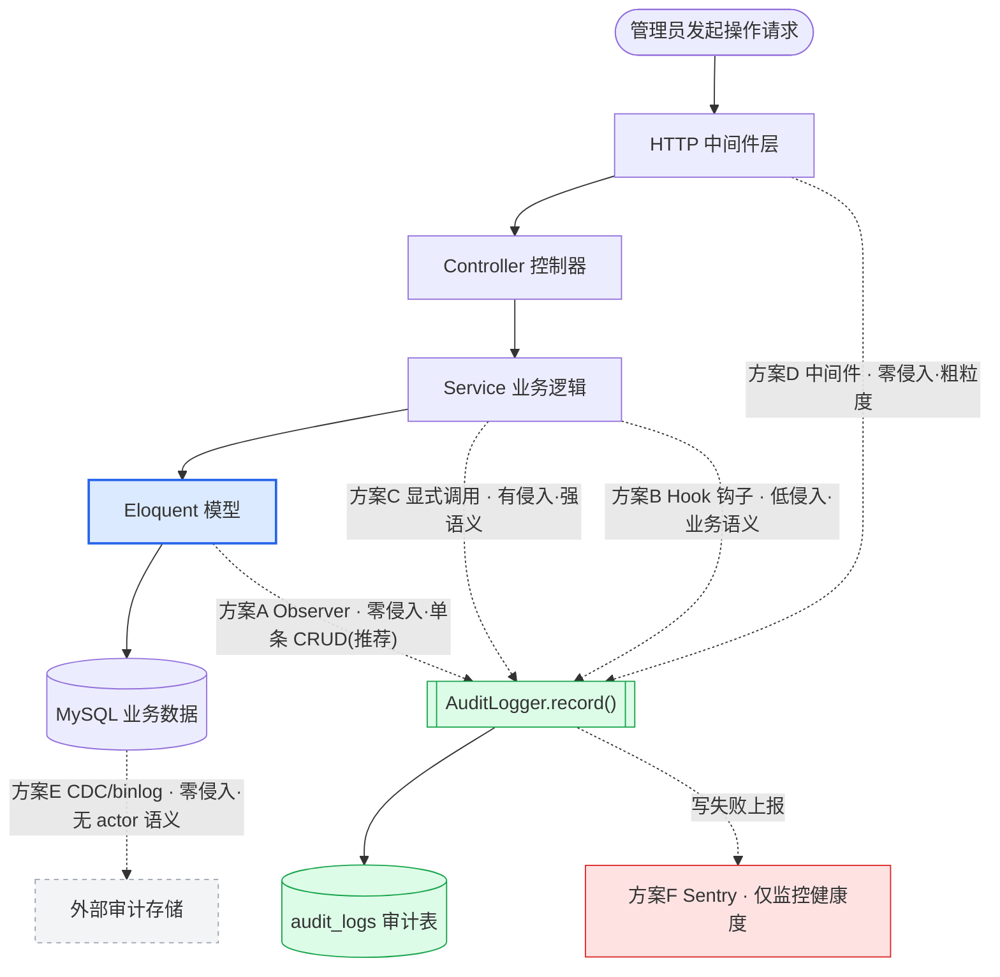
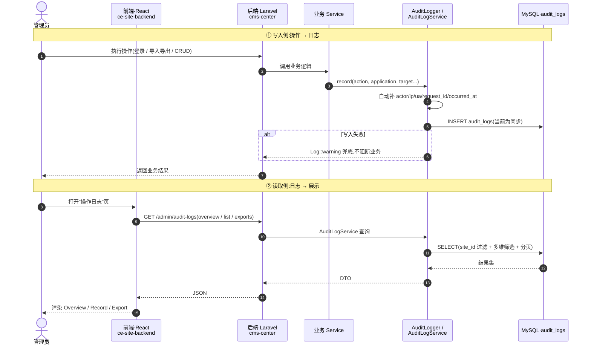

# 操作日志(Operation Logs)埋点技术方案

> 版本:v1.0 ｜ 日期:2026-06-26 ｜ 范围:cms-center(Laravel)+ ce-site-backend(React)
> 关联 PRD:《操作日志 v1.1(完整版)》(FR-001 ~ FR-007)

---

## 0. 摘要(TL;DR)

- **目标**:在尽量**不侵入业务代码**的前提下,把平台各类操作(尤其是 CRUD)纳入审计日志,落地 PRD 的"事件自动采集(FR-004)"。
- **关键现状**:cms-center **已具备完整的审计日志地基**(`audit_logs` 表 + `AuditLogger` 写入服务 + 查询 API + React 前端三 Tab),且**登录登出、导入导出 4 类事件已经埋点**。真正缺的是**大量 CRUD 操作未覆盖**。
- **推荐方案**:**混合策略** —— 单条 CRUD 用 **Eloquent Model Observer**(零业务代码侵入,项目已有同款范式),批量/高层业务(导入导出、权限变更、发布审核)保持**显式埋点 / Hook 钩子**。
- **Sentry 结论**:**不推荐**用 Sentry 承载审计日志(定位错配、合规与成本问题、且会与现有设施重复建设);其正确定位是**监控埋点系统自身的写入健康度**。
- **零代码理想方案(DB CDC/binlog)**:技术上最"无侵入",但拿不到"操作人/可读对象名/业务语义",**不满足审计需求**,不作为主方案。

---

## 1. 背景与目标

### 1.1 背景
操作日志功能用于**审计与监控平台操作**,PRD 定义了三大视图(Overview 概览 / Record 记录 / Export 导出)、约 30 种操作事件、多维筛选、CSV 导出与日志保留策略。当前需要解决的核心问题是:**操作事件如何被采集并写入日志表**,且希望尽量不改动既有业务代码。

### 1.2 目标
- **功能目标**:覆盖 PRD 要求的操作事件(CRUD、认证、导入导出、发布审核、系统集成、安全告警等),写入结构化审计记录。
- **非功能目标**:
  - 低侵入:尽量不修改 Controller/Service 业务逻辑。
  - 可靠:埋点失败不阻断主业务。
  - 可查询/可导出:满足多维筛选与 CSV 合规存档。
  - 多租户隔离:按 `site_id` 区分。
  - 可控成本:存储与写入开销可控,支持保留策略/清理。

---

## 2. 现状盘点

### 2.1 两仓库角色

| 仓库 | 技术栈 | 在方案中的角色 |
|---|---|---|
| **cms-center** | PHP 8.2 + Laravel 12 + Eloquent + MySQL(:3307) | **写 / 存 / 查** 日志的唯一载体 |
| **ce-site-backend** | TypeScript + React 18 + Vite | **仅展示**:调用 `/admin/audit-logs*` 渲染三个 Tab,不接触数据库 |

> 注意:`ce-site-backend` 名为 backend,实为**前端管理后台 SPA**。埋点只发生在 cms-center。

### 2.2 已有审计基础设施(关键:地基已就绪)

| 组件 | 位置 | 说明 |
|---|---|---|
| 数据表 | `audit_logs`(迁移 `2026_06_25_000001`) | 含 site_id / actor / action / application / target_* / result / content / metadata / ip / user_agent / request_id / occurred_at,且建有 site+time、action+time、actor+time、request_id 索引 |
| 模型 | `app/Models/AuditLog.php` | 字段与 PRD Record 表几乎一一对应 |
| 写入服务 | `app/Services/AuditLogger.php` | `record($payload)`:**自动兜底** actor / site_id / ip / user_agent / request_id / occurred_at;写失败仅 `Log::warning`,**不阻断业务** |
| 查询服务 | `app/Services/AuditLogService.php` | overview / list / exports 三类查询 |
| API | `app/Http/Controllers/Admin/V1/AuditLogController.php` | `/admin/audit-logs`、`/overview`、`/exports` |
| 前端 | `ce-site-backend` `src/pages/safety/operation-logs/` | Overview / Record / Export 三 Tab |

### 2.3 已埋点 vs 未覆盖

- **已埋点**:`LoginService`(`logged_in` / `logout`)、`ImportExportManager`(`exported` / `imported`)。
- **未覆盖**:绝大多数 CRUD(增删改)、权限/角色变更、发布审核、系统集成等。

### 2.4 可复用的无侵入机制(项目已具备)

- **Eloquent Model Events / Observer**:项目已有 `UsageSourceObserver`,采用"**全局 observe + 接口守卫**"范式。
- **HookManager**:基于 Symfony EventDispatcher 的 action/filter 钩子(`app/Support/HookManager.php`)。
- **Laravel Queue**:已配置队列监听(`QueueJobListener`),可用于异步化写入。
- **Laravel Middleware**:已有 22 个中间件(权限/CORS 等)。

---

## 3. 候选方案详述

### 方案 A:Eloquent Model Observer(ORM 事件)⭐
- **原理**:监听模型 `created/updated/deleted/restored` 等生命周期事件,在事件回调中调用 `AuditLogger`。
- **侵入度**:**极低**。Controller/Service 不动;模型仅需声明"可审计"(实现接口/特征)。
- **业务语义**:中。可拿到模型属性、变更字段;但拿不到"操作动机"、跨实体语义。
- **覆盖范围**:所有走 Eloquent 实例的单条增删改。
- **致命坑**:
  - **批量 `Model::query()->update()/delete()` 不触发事件**(走 Query Builder,不实例化模型)。
  - **队列/CLI 上下文 `Auth::user()` 为空**,actor 需另行注入。
  - 需控制噪音(只记脏字段)、需把事件名映射到 PRD 的 action 枚举。
- **契合度**:项目已有 `UsageSourceObserver` 同款范式,风格统一、上手快。

### 方案 B:HookManager Action 钩子(业务事件)
- **原理**:在业务关键节点触发 `do_action('xxx')`,注册监听器调用 `AuditLogger`。
- **侵入度**:低~中(取决于业务点是否已布钩子)。
- **业务语义**:**高**。可携带完整业务上下文。
- **覆盖范围**:已埋钩子的高层业务事件(发布、审核、权限变更、卸载等)。
- **坑**:依赖业务代码里已存在钩子点;未布点处仍需补点(轻度侵入)。

### 方案 C:显式调用 AuditLogger(现状做法)
- **原理**:在 Service 方法内直接 `auditLogger->record([...])`。
- **侵入度**:**高**(逐处加代码)。
- **业务语义**:**最高**,可精确区分成功/失败/部分成功并定制内容。
- **覆盖范围**:逐点覆盖,可控但费人力。
- **现状**:登录登出、导入导出即用此法,**适合批量与强语义场景**。

### 方案 D:HTTP 中间件(路由级拦截)
- **原理**:在中间件层根据路由/方法/状态码记录访问。
- **侵入度**:**零**。
- **业务语义**:**低**。只知道"调了哪个接口、成功否",不知道"操作了哪条数据、可读名称"。
- **覆盖范围**:全量 HTTP 请求(粗粒度)。
- **定位**:仅作粗粒度访问日志补充,**不能单独满足 PRD**。

### 方案 E:数据库 CDC(binlog,如 Debezium/Maxwell)
- **原理**:监听 MySQL binlog,捕获行级变更写入审计存储。
- **侵入度**:**零(连应用框架都不碰)**。
- **业务语义**:**极低**。没有 actor(谁)、没有可读 target_name、没有 application 归类;批量与单条无法区分操作意图。
- **成本**:需引入 CDC 组件 + 运维。
- **定位**:适合"数据变更同步/灾备审计",**不适合"谁对什么做了什么"的业务审计**。不作为主方案。

### 方案 F(专项):Sentry / APM —— 见第 5 节专项评估
- **结论**:不适合做审计日志存储。

---

## 4. 方案对比评分矩阵

评分:★★★ 优 / ★★ 中 / ★ 差(从"满足审计目标"角度)

| 维度 | A. Observer | B. Hook | C. 显式调用 | D. 中间件 | E. DB CDC | F. Sentry |
|---|---|---|---|---|---|---|
| 业务代码非侵入 | ★★★ | ★★ | ★ | ★★★ | ★★★ | ★★ |
| 业务语义完整度 | ★★ | ★★★ | ★★★ | ★ | ★ | ★ |
| 覆盖范围(单条 CRUD) | ★★★ | ★ | ★★ | ★★ | ★★★ | ★ |
| 覆盖批量操作 | ★(需补) | ★★ | ★★★ | ★★ | ★★★ | ★ |
| 实现/接入成本 | ★★★(低) | ★★ | ★(高) | ★★★ | ★(高) | ★★ |
| 性能影响可控 | ★★(可异步) | ★★ | ★★ | ★★★ | ★★★ | ★★ |
| 可维护/统一风格 | ★★★(已有范式) | ★★ | ★ | ★★ | ★ | ★ |
| 合规/数据自主可控 | ★★★ | ★★★ | ★★★ | ★★★ | ★★ | ★(第三方) |
| **综合(审计目标)** | **推荐主力** | **推荐补充** | **保留现状** | 可选补充 | 不采用 | 不采用(改作监控) |

---

## 5. Sentry 专项评估

### 5.1 为什么不推荐用 Sentry 承载审计日志
1. **定位错配**:Sentry 是错误/性能监控(APM),数据模型是 issue/event/breadcrumb,围绕"异常聚类"设计,而非"谁-对什么-做了什么-结果如何"的结构化审计。
2. **PRD 硬需求满足不了**:多维筛选(operator/action/application/target/result)、精确分页、**CSV 合规导出**、**90 天保留策略**、**按 site_id 多租户隔离**——这些 Sentry 难以胜任。
3. **成本**:按事件量计费;审计为高频写入,量大账单高。自建 MySQL 表近乎零边际成本。
4. **合规**:审计数据通常要求自主可控、可信留存;推送第三方 SaaS 有数据出境/合规顾虑。
5. **重复建设**:项目已有 `audit_logs` 表 + 写入/查询服务 + 前端页面;Sentry 解决的是"异常诊断",不是"业务审计"。

### 5.2 Sentry 的正确定位(建议保留的价值)
当前 `AuditLogger` 写入失败仅 `Log::warning` 静默处理,**无法感知审计漏记**。可用 Sentry **监控埋点系统自身健康度**(写入失败告警),数据本体仍存 MySQL。职责清晰、不越位。

---

## 6. 推荐方案:混合策略

> 一句话:**Observer 兜底单条 CRUD(无侵入广覆盖)+ 显式/Hook 处理批量与强语义(精确)+ 中间件可选粗粒度 + Sentry 仅监控健康度。**

| 操作类型 | 采用机制 | 理由 |
|---|---|---|
| 单条增删改(CRUD) | **方案 A Observer** | 零业务侵入、一次注册全自动、复用现有范式 |
| 批量操作(导入导出、批量增删改) | **方案 C 显式 / B Hook** | 批量绕过 Model Events,且需强业务语义(现状即如此,**保持不变是正确的**) |
| 高层业务(权限变更/发布审核/集成) | **方案 B Hook** | 业务上下文丰富,钩子机制已具备 |
| 粗粒度访问审计(可选) | 方案 D 中间件 | 作为兜底补充,不单独承担 |
| 埋点健康度监控 | Sentry(可选) | 写失败告警,不存日志 |

**为什么这是最优**:用 Observer 以最低成本拿下数量最多、最零散的 CRUD;用显式/Hook 精确处理批量与强语义场景(规避 Model Events 的批量盲区);整体不引入新存储、不破坏合规、与现有代码风格一致。

---

## 7. 分阶段实施路线(对齐 PRD)

| 阶段 | 内容 | 对应 PRD | 风险/产出 |
|---|---|---|---|
| **阶段 0｜验证现状** | 验证登录登出/导入导出 4 处埋点确实写入 `audit_logs`,确认前端三 Tab 能读 | FR-001~003 | 确认地基可用,信息量最大 |
| **阶段 1｜Observer 试点** | 选 1 个 CRUD 模型(如 AdminUser),挂全局 Observer,跑通 created/updated/deleted | FR-004 | 验证无侵入埋点闭环 |
| **阶段 2｜扩面 + 枚举映射** | 逐个模型纳入审计;统一 action 枚举映射(created→Created 等);脏字段过滤降噪 | FR-004 | 每加一个模型即一次小迭代 |
| **阶段 3｜高层业务 + 批量** | 用 Hook/显式补齐权限变更、发布审核、批量操作 | FR-004 | 覆盖 Observer 盲区 |
| **阶段 4｜异步化** | 将写入包装为 Queue Job,降低主链路开销(项目已有 Queue) | 非功能 | 性能优化 |
| **阶段 5｜保留与清理** | 落地保留策略(默认 90 天)与 Clean up | FR-006/007 | 控制存储增长 |
| **阶段 6｜健康监控(可选)** | 接 Sentry 监控埋点写入失败 | 非功能 | 防漏记 |

---

## 8. 工作量与成本估算(粗略 T-shirt size)

| 阶段 | 估算 | 说明 |
|---|---|---|
| 阶段 0 验证 | XS(0.5 天) | 跑通现有链路 |
| 阶段 1 试点 | S(1 天) | Observer + 接口 + 注册 + 1 模型 |
| 阶段 2 扩面 | M(按模型数量线性) | 每模型增量很小 |
| 阶段 3 高层/批量 | M(视业务点数量) | 逐点补 |
| 阶段 4 异步化 | S~M | 引入 Job + 测试 |
| 阶段 5 保留/清理 | S~M | 定时任务 + 策略配置 |
| 阶段 6 Sentry | XS | 仅一处接入(需申请 DSN) |

> 不新增数据库/中间件依赖(除可选 Sentry),**主要成本在阶段 2/3 的逐点覆盖**,但单点成本极低。

---

## 9. 决策建议(汇报结论页)

1. **不引入 Sentry 作为日志存储**;审计数据继续落 cms-center 的 `audit_logs`(自主可控、合规、零额外成本)。
2. **主力机制选 Eloquent Observer**(零业务侵入、复用项目已有范式),**批量与强语义保持显式/Hook**。
3. **DB CDC 不采用**(拿不到 actor/业务语义,不满足审计目标)。
4. **小步迭代从"验证现状"起步**:现有 4 类事件已埋点,先确认闭环,再用 Observer 逐模型扩面。
5. **Sentry 仅作为可选的"埋点健康度监控"**,需申请 DSN,接入成本极低。

---

## 10. 附图

### 图 1:方案架构对比图(各方案的埋点切入点)

> 主干为业务请求链路;虚线为各方案的"埋点切入点"。越靠下越无侵入,但越拿不到业务语义。

### 图 2:现状数据流时序图(写入侧 + 读取侧)

---

## 附录:关键参考文件

| 用途 | 路径 |
|---|---|
| 写入服务 | `cms-center/app/Services/AuditLogger.php` |
| 查询服务 | `cms-center/app/Services/AuditLogService.php` |
| 模型 | `cms-center/app/Models/AuditLog.php` |
| 迁移 | `cms-center/database/migrations/2026_06_25_000001_create_audit_logs_table.php` |
| 控制器/API | `cms-center/app/Http/Controllers/Admin/V1/AuditLogController.php` |
| Observer 范式参考 | `cms-center/app/Observers/UsageSourceObserver.php` + `AppServiceProvider::registerUsageSourceObserver()` |
| Hook 系统 | `cms-center/app/Support/HookManager.php` |
| 已埋点示例 | `cms-center/app/Services/LoginService.php`、`cms-center/app/Support/ImportExportManager.php` |
| 前端展示 | `ce-site-backend/src/pages/safety/operation-logs/index.tsx` |

> 备注:cms-center 仓库代码改动默认走 Harness 工作流(见该仓库 CLAUDE.md)。本方案为汇报用,不含落地代码改动。
